# Core Models Class Diagram

This diagram shows the core data models that flow through every layer of ConductorAI: models, messages, state, enums, and configuration.

## Class Diagram

```mermaid
classDiagram
    %% ==========================================
    %% Enumerations
    %% ==========================================
    class AgentType {
        <<enumeration>>
        +CODING
        +REVIEW
        +TEST_DATA
        +TEST
        +DEVOPS
        +DEPLOYING
        +MONITOR
    }

    class AgentStatus {
        <<enumeration>>
        +IDLE
        +RUNNING
        +WAITING
        +COMPLETED
        +FAILED
        +CANCELLED
    }

    class TaskStatus {
        <<enumeration>>
        +PENDING
        +IN_PROGRESS
        +COMPLETED
        +FAILED
        +CANCELLED
    }

    class WorkflowPhase {
        <<enumeration>>
        +DEVELOPMENT
        +DEVOPS
        +MONITORING
    }

    class MessageType {
        <<enumeration>>
        +TASK_ASSIGNMENT
        +TASK_RESULT
        +FEEDBACK
        +ERROR
        +STATUS_UPDATE
        +CONTROL
    }

    class Priority {
        <<enumeration>>
        +LOW
        +MEDIUM
        +HIGH
        +CRITICAL
    }

    %% ==========================================
    %% Core Models (models.py)
    %% ==========================================
    class AgentIdentity {
        +str agent_id
        +AgentType agent_type
        +str name
        +str version
        +Optional~str~ description
    }

    class TaskDefinition {
        +str task_id
        +str name
        +str description
        +Optional~AgentType~ assigned_to
        +Priority priority
        +dict~str, Any~ input_data
        +int timeout_seconds
        +datetime created_at
        +dict~str, Any~ metadata
    }

    class TaskResult {
        +str task_id
        +str agent_id
        +TaskStatus status
        +dict~str, Any~ output_data
        +Optional~str~ error_message
        +datetime started_at
        +Optional~datetime~ completed_at
        +Optional~float~ duration_seconds
        +dict~str, Any~ metadata
    }

    class WorkflowDefinition {
        +str workflow_id
        +str name
        +str description
        +list~WorkflowPhase~ phases
        +list~TaskDefinition~ tasks
        +datetime created_at
        +dict~str, Any~ metadata
    }

    %% ==========================================
    %% State Models (state.py)
    %% ==========================================
    class AgentState {
        +str agent_id
        +AgentType agent_type
        +AgentStatus status
        +Optional~str~ current_task_id
        +list~str~ completed_tasks
        +int error_count
        +datetime last_heartbeat
        +datetime updated_at
        +dict~str, Any~ metadata
    }

    class WorkflowState {
        +str workflow_id
        +TaskStatus status
        +WorkflowPhase current_phase
        +dict~str, AgentState~ agent_states
        +dict~str, TaskResult~ task_results
        +list~str~ pending_tasks
        +list~str~ completed_tasks
        +list~str~ failed_tasks
        +int feedback_loop_count
        +datetime started_at
        +Optional~datetime~ completed_at
        +dict~str, Any~ metadata
        +is_complete() bool
        +get_phase_completion(WorkflowPhase) float
    }

    %% ==========================================
    %% Message Models (messages.py)
    %% ==========================================
    class AgentMessage {
        +str message_id
        +MessageType message_type
        +str sender_id
        +Optional~str~ recipient_id
        +dict~str, Any~ payload
        +Optional~str~ correlation_id
        +Priority priority
        +datetime timestamp
        +Optional~int~ ttl_seconds
        +dict~str, Any~ metadata
        +is_expired() bool
        +create_response(str, MessageType, dict) AgentMessage
    }

    class TaskAssignmentPayload {
        +TaskDefinition task
    }

    class TaskResultPayload {
        +TaskResult result
    }

    class FeedbackPayload {
        +str source_agent_id
        +list~str~ findings
        +str severity
        +list~str~ recommendations
        +list~str~ affected_task_ids
        +dict~str, Any~ metrics
    }

    class ErrorPayload {
        +str error_code
        +str error_message
        +Optional~str~ agent_id
        +Optional~str~ task_id
        +Optional~str~ traceback
    }

    class StatusUpdatePayload {
        +str agent_id
        +str status
        +Optional~str~ current_task_id
        +Optional~float~ progress_percent
        +Optional~str~ message
    }

    %% ==========================================
    %% Configuration Models (config.py)
    %% ==========================================
    class ConductorConfig {
        +str environment
        +str log_level
        +RedisConfig redis
        +LLMConfig llm
        +int max_concurrent_tasks
        +int task_timeout_seconds
        +bool enable_monitoring
    }

    class RedisConfig {
        +str url
        +int max_connections
        +str key_prefix
        +float socket_timeout
    }

    class LLMConfig {
        +str provider
        +str model
        +str api_key
        +float temperature
        +int max_tokens
        +int timeout_seconds
    }

    %% ==========================================
    %% Relationships
    %% ==========================================
    
    %% Models use Enums
    AgentIdentity --> AgentType : uses
    TaskDefinition --> AgentType : assigned_to
    TaskDefinition --> Priority : has
    TaskResult --> TaskStatus : has
    WorkflowDefinition --> WorkflowPhase : contains
    AgentState --> AgentType : has
    AgentState --> AgentStatus : has
    WorkflowState --> TaskStatus : has
    WorkflowState --> WorkflowPhase : current_phase
    AgentMessage --> MessageType : has
    AgentMessage --> Priority : has

    %% Task relationships
    TaskResult --> TaskDefinition : references via task_id
    WorkflowDefinition *-- TaskDefinition : contains many

    %% State relationships
    WorkflowState *-- AgentState : contains many
    WorkflowState *-- TaskResult : contains many
    AgentState --> TaskDefinition : references via current_task_id

    %% Message payload relationships
    AgentMessage o-- TaskAssignmentPayload : payload
    AgentMessage o-- TaskResultPayload : payload
    AgentMessage o-- FeedbackPayload : payload
    AgentMessage o-- ErrorPayload : payload
    AgentMessage o-- StatusUpdatePayload : payload
    TaskAssignmentPayload --> TaskDefinition : contains
    TaskResultPayload --> TaskResult : contains

    %% Config relationships
    ConductorConfig *-- RedisConfig : contains
    ConductorConfig *-- LLMConfig : contains

    %% Identity and State
    AgentState --> AgentIdentity : references via agent_id
```

## Key Relationships

### Model Hierarchy
- **AgentIdentity**: Static "who am I" information (ID card)
- **AgentState**: Dynamic "what am I doing" information (current status)
- **TaskDefinition**: Job ticket describing work to be done
- **TaskResult**: Job report describing what happened

### Message Flow
1. **AgentMessage** is the universal envelope for all communication
2. **Payload types** provide type-safe structures for different message types:
   - `TaskAssignmentPayload`: Coordinator → Agent
   - `TaskResultPayload`: Agent → Coordinator
   - `FeedbackPayload`: Monitor → Coordinator
   - `ErrorPayload`: Any component → Error Handler
   - `StatusUpdatePayload`: Agent → All (heartbeat)

### Workflow Structure
- **WorkflowDefinition**: High-level plan with phases and tasks
- **WorkflowState**: Live execution state tracking progress across all phases
- Contains both **AgentState** (what agents are doing) and **TaskResult** (what's been completed)

## Design Principles

1. **Immutable by convention**: Models represent snapshots, not mutable state
2. **Self-validating**: Pydantic enforces type/value constraints at creation
3. **Serializable**: All models convert to/from JSON for Redis/APIs
4. **Documented**: Every field has a description for API docs and IDE hints
