# Agent Layer Class Diagram

This diagram shows the agent hierarchy and specialized agent implementations in ConductorAI.

## Class Diagram

```mermaid
classDiagram
    %% ==========================================
    %% Base Agent (Abstract)
    %% ==========================================
    class BaseAgent {
        <<abstract>>
        -AgentIdentity _identity
        -AgentState _state
        -ConductorConfig _config
        -Logger _logger
        
        +BaseAgent(agent_id, agent_type, config, name, description)
        
        %% Properties
        +identity AgentIdentity
        +agent_id str
        +agent_type AgentType
        +state AgentState
        +status AgentStatus
        
        %% Lifecycle
        +start() void
        +stop() void
        
        %% Task Execution (Template Method)
        +execute_task(TaskDefinition) TaskResult
        
        %% Message Handling
        +handle_message(AgentMessage) Optional~AgentMessage~
        
        %% Abstract Methods - Subclasses MUST implement
        +_execute(TaskDefinition)* TaskResult
        +_validate_task(TaskDefinition)* bool
        
        %% Optional Hooks - Subclasses CAN override
        +_on_start() void
        +_on_stop() void
        
        %% Helper Methods
        -_update_state(status, current_task_id, ...) void
        -_create_result(task_id, status, output, ...) TaskResult
    }

    %% ==========================================
    %% Development Phase Agents
    %% ==========================================
    class CodingAgent {
        -BaseLLMProvider _llm_provider
        -str _system_prompt
        
        +CodingAgent(agent_id, config, llm_provider)
        +_execute(TaskDefinition) TaskResult
        +_validate_task(TaskDefinition) bool
        -_build_user_prompt(input_data) str
        -_parse_llm_response(response) dict
    }

    class ReviewAgent {
        -BaseLLMProvider _llm_provider
        -str _system_prompt
        -list~str~ _default_criteria
        
        +ReviewAgent(agent_id, config, llm_provider)
        +_execute(TaskDefinition) TaskResult
        +_validate_task(TaskDefinition) bool
        -_build_review_prompt(code, criteria) str
        -_parse_review_response(response) dict
    }

    class TestDataAgent {
        -BaseLLMProvider _llm_provider
        -str _system_prompt
        
        +TestDataAgent(agent_id, config, llm_provider)
        +_execute(TaskDefinition) TaskResult
        +_validate_task(TaskDefinition) bool
        -_build_data_generation_prompt(schema) str
        -_parse_test_data(response) dict
    }

    class TestAgent {
        -BaseLLMProvider _llm_provider
        -str _system_prompt
        
        +TestAgent(agent_id, config, llm_provider)
        +_execute(TaskDefinition) TaskResult
        +_validate_task(TaskDefinition) bool
        -_build_test_prompt(code, language) str
        -_run_tests(test_code) dict
    }

    %% ==========================================
    %% DevOps Phase Agents
    %% ==========================================
    class DevOpsAgent {
        -BaseLLMProvider _llm_provider
        -str _system_prompt
        
        +DevOpsAgent(agent_id, config, llm_provider)
        +_execute(TaskDefinition) TaskResult
        +_validate_task(TaskDefinition) bool
        -_build_devops_prompt(code, platform) str
        -_generate_ci_cd_config(code) dict
    }

    class DeployingAgent {
        -BaseLLMProvider _llm_provider
        -dict _deployment_strategies
        
        +DeployingAgent(agent_id, config, llm_provider)
        +_execute(TaskDefinition) TaskResult
        +_validate_task(TaskDefinition) bool
        -_deploy_to_environment(config, environment) dict
        -_verify_deployment(deployment_info) bool
    }

    %% ==========================================
    %% Monitoring Phase Agents
    %% ==========================================
    class MonitorAgent {
        -BaseLLMProvider _llm_provider
        -str _system_prompt
        -dict~str, float~ _metric_thresholds
        
        +MonitorAgent(agent_id, config, llm_provider)
        +_execute(TaskDefinition) TaskResult
        +_validate_task(TaskDefinition) bool
        -_collect_metrics(deployment_info) dict
        -_analyze_metrics(metrics) FeedbackPayload
        -_generate_feedback(findings) dict
    }

    %% ==========================================
    %% Core Models Used by Agents
    %% ==========================================
    class AgentIdentity {
        +str agent_id
        +AgentType agent_type
        +str name
        +str version
        +Optional~str~ description
    }

    class AgentState {
        +str agent_id
        +AgentType agent_type
        +AgentStatus status
        +Optional~str~ current_task_id
        +list~str~ completed_tasks
        +list~str~ failed_tasks
        +int error_count
        +datetime last_heartbeat
        +datetime updated_at
    }

    class TaskDefinition {
        +str task_id
        +str name
        +str description
        +Optional~AgentType~ assigned_to
        +Priority priority
        +dict~str, Any~ input_data
        +int timeout_seconds
    }

    class TaskResult {
        +str task_id
        +str agent_id
        +TaskStatus status
        +dict~str, Any~ output_data
        +Optional~str~ error_message
        +datetime started_at
        +Optional~datetime~ completed_at
        +Optional~float~ duration_seconds
    }

    class AgentMessage {
        +str message_id
        +MessageType message_type
        +str sender_id
        +Optional~str~ recipient_id
        +dict~str, Any~ payload
    }

    class ConductorConfig {
        +str environment
        +str log_level
        +LLMConfig llm
    }

    %% ==========================================
    %% LLM Provider (Integration Layer)
    %% ==========================================
    class BaseLLMProvider {
        <<abstract>>
        +generate(prompt) str
        +generate_with_system(system, user) str
        +generate_stream(prompt) AsyncIterator
    }

    %% ==========================================
    %% Relationships
    %% ==========================================
    
    %% Inheritance Hierarchy - Development Agents
    BaseAgent <|-- CodingAgent : extends
    BaseAgent <|-- ReviewAgent : extends
    BaseAgent <|-- TestDataAgent : extends
    BaseAgent <|-- TestAgent : extends
    
    %% Inheritance Hierarchy - DevOps Agents
    BaseAgent <|-- DevOpsAgent : extends
    BaseAgent <|-- DeployingAgent : extends
    
    %% Inheritance Hierarchy - Monitoring Agents
    BaseAgent <|-- MonitorAgent : extends
    
    %% Base Agent Composition
    BaseAgent *-- AgentIdentity : contains
    BaseAgent *-- AgentState : contains
    BaseAgent --> ConductorConfig : uses
    
    %% Agent Operations
    BaseAgent ..> TaskDefinition : receives
    BaseAgent ..> TaskResult : produces
    BaseAgent ..> AgentMessage : handles
    
    %% LLM Integration
    CodingAgent --> BaseLLMProvider : uses
    ReviewAgent --> BaseLLMProvider : uses
    TestDataAgent --> BaseLLMProvider : uses
    TestAgent --> BaseLLMProvider : uses
    DevOpsAgent --> BaseLLMProvider : uses
    DeployingAgent --> BaseLLMProvider : uses
    MonitorAgent --> BaseLLMProvider : uses
```



## Agent Hierarchy

### Base Agent (Abstract)
The **BaseAgent** implements the Template Method pattern:
- Defines the task execution lifecycle skeleton
- Handles state transitions and error handling
- Provides logging, message handling, and helper methods
- Subclasses implement `_execute()` and `_validate_task()`

### Development Phase Agents

1. **CodingAgent**
   - Generates source code from specifications
   - Input: `specification`, `language`, `framework`
   - Output: `code`, `language`, `description`, `files`

2. **ReviewAgent**
   - Reviews code quality, bugs, and best practices
   - Input: `code`, `review_criteria`
   - Output: `approved`, `findings`, `quality_score`, `recommendations`

3. **TestDataAgent**
   - Generates test data and fixtures
   - Input: `schema`, `count`, `constraints`
   - Output: `test_data`, `format`, `count`

4. **TestAgent**
   - Creates and executes test suites
   - Input: `code`, `language`, `test_framework`
   - Output: `test_code`, `passed`, `failed`, `results`

### DevOps Phase Agents

5. **DevOpsAgent**
   - Creates CI/CD pipelines, Dockerfiles, infra configs
   - Input: `code`, `platform`, `deployment_target`
   - Output: `ci_cd_config`, `dockerfile`, `infrastructure_code`

6. **DeployingAgent**
   - Handles deployment to target environments
   - Input: `deployment_config`, `environment`, `strategy`
   - Output: `deployment_status`, `url`, `logs`

### Monitoring Phase Agents

7. **MonitorAgent**
   - Monitors deployed systems and generates feedback
   - Input: `deployment_info`, `metrics_config`
   - Output: `metrics`, `findings`, `severity`, `recommendations`

## Task Execution Lifecycle

```
1. Coordinator → dispatch_task(task)
2. BaseAgent.execute_task(task):
   a. _validate_task(task) ← Subclass implements
   b. Set status → RUNNING
   c. _execute(task) ← Subclass implements (LLM call)
   d. Set status → COMPLETED/FAILED
   e. Return TaskResult
3. Agent → return result to Coordinator
```

## Design Patterns

### Template Method Pattern
- **BaseAgent.execute_task()** defines the algorithm skeleton
- Subclasses implement **_execute()** (the actual work)
- Ensures consistent behavior across all agent types

### Strategy Pattern
- Each agent has a different strategy for its **_execute()** method
- CodingAgent: LLM prompt for code generation
- ReviewAgent: LLM prompt for code review
- TestAgent: LLM prompt + test execution
- MonitorAgent: Metrics collection + analysis

### Dependency Injection
- LLM providers and configuration are injected via constructor
- Enables testing with mock providers
- Allows runtime provider swapping

## Key Responsibilities

### BaseAgent
- ✅ Task validation and execution orchestration
- ✅ State management and transitions
- ✅ Error handling and logging
- ✅ Message handling from bus
- ❌ Does NOT contain business logic (delegated to subclasses)

### Specialized Agents
- ✅ Task-specific validation logic
- ✅ LLM prompt engineering
- ✅ Response parsing and validation
- ✅ Result formatting
- ❌ Do NOT manage their own state (delegated to BaseAgent)
