# Orchestration Layer Class Diagram

This diagram shows the orchestration components that manage workflow execution, agent coordination, message routing, state persistence, policy enforcement, and error handling.

## Class Diagram

```mermaid
classDiagram
    %% ==========================================
    %% Message Bus (Communication Backbone)
    %% ==========================================
    class MessageBus {
        <<abstract>>
        +connect() void
        +disconnect() void
        +publish(channel, message) void
        +subscribe(channel, callback) void
        +unsubscribe(channel, callback) void
        +request(channel, message, timeout) AgentMessage
    }

    class InMemoryMessageBus {
        -dict~str, list~ _subscriptions
        -dict~str, Future~ _pending_requests
        -bool _connected
        +connect() void
        +disconnect() void
        +publish(channel, message) void
        +subscribe(channel, callback) void
        +unsubscribe(channel, callback) void
        +request(channel, message, timeout) AgentMessage
    }

    %% ==========================================
    %% State Manager (Persistence Layer)
    %% ==========================================
    class StateManager {
        <<abstract>>
        +connect() void
        +disconnect() void
        +save_agent_state(AgentState) void
        +get_agent_state(agent_id) AgentState
        +delete_agent_state(agent_id) bool
        +list_agent_states() list~AgentState~
        +save_workflow_state(WorkflowState) void
        +get_workflow_state(workflow_id) WorkflowState
        +save_task_result(TaskResult) void
        +get_task_result(task_id) TaskResult
    }

    class InMemoryStateManager {
        -dict~str, AgentState~ _agent_states
        -dict~str, WorkflowState~ _workflow_states
        -dict~str, TaskResult~ _task_results
        -bool _connected
        +connect() void
        +disconnect() void
        +save_agent_state(AgentState) void
        +get_agent_state(agent_id) AgentState
        +list_agent_states() list~AgentState~
        +save_workflow_state(WorkflowState) void
        +get_workflow_state(workflow_id) WorkflowState
        +save_task_result(TaskResult) void
        +get_task_result(task_id) TaskResult
    }

    %% ==========================================
    %% Agent Coordinator (Central Dispatcher)
    %% ==========================================
    class AgentCoordinator {
        -dict~str, BaseAgent~ _agents
        -MessageBus _message_bus
        -StateManager _state_manager
        -PolicyEngine _policy_engine
        -ErrorHandler _error_handler
        -bool _started
        
        +AgentCoordinator(bus, state_mgr, policy, error_handler)
        +start() void
        +stop() void
        +register_agent(BaseAgent) void
        +unregister_agent(agent_id) void
        +dispatch_task(TaskDefinition) TaskResult
        +get_available_agents(AgentType) list~BaseAgent~
        +get_agent_status(agent_id) AgentState
        -_find_available_agent(AgentType) BaseAgent
        -_sync_agent_state(BaseAgent) void
    }

    %% ==========================================
    %% Workflow Engine (Multi-Phase Orchestrator)
    %% ==========================================
    class WorkflowEngine {
        -AgentCoordinator _coordinator
        -StateManager _state_manager
        -PolicyEngine _policy_engine
        -int _max_feedback_loops
        
        +WorkflowEngine(coordinator, state_mgr, policy, max_loops)
        +run_workflow(WorkflowDefinition) WorkflowState
        -_execute_phase(WorkflowPhase, tasks, state) void
        -_check_phase_gate(WorkflowPhase, state) bool
        -_handle_feedback(feedback, state) bool
        -_collect_phase_tasks(WorkflowPhase, tasks) list~TaskDefinition~
    }

    %% ==========================================
    %% Policy Engine (Rule Enforcement)
    %% ==========================================
    class PolicyEngine {
        -list~Policy~ _policies
        
        +PolicyEngine()
        +register_policy(Policy) void
        +unregister_policy(policy_name) void
        +evaluate_all(context) list~PolicyResult~
        +check(context) bool
        +enforce(context) void
        +get_policy(policy_name) Policy
        +list_policies() list~str~
    }

    class Policy {
        <<abstract>>
        +name str
        +description str
        +evaluate(context)* PolicyResult
    }

    class PolicyResult {
        +bool allowed
        +str policy_name
        +str reason
        +dict~str, Any~ metadata
    }

    class MaxConcurrentTasksPolicy {
        -int _max_tasks
        +name str
        +description str
        +evaluate(context) PolicyResult
    }

    class TaskTimeoutPolicy {
        -float _default_timeout
        -float _max_timeout
        +name str
        +description str
        +evaluate(context) PolicyResult
    }

    class PhaseGatePolicy {
        -float _min_success_rate
        +name str
        +description str
        +evaluate(context) PolicyResult
    }

    class AgentAvailabilityPolicy {
        +name str
        +description str
        +evaluate(context) PolicyResult
    }

    %% ==========================================
    %% Error Handler (Resilience Layer)
    %% ==========================================
    class ErrorHandler {
        -MessageBus _message_bus
        -StateManager _state_manager
        -RetryPolicy _default_retry_policy
        -dict~str, CircuitBreaker~ _circuit_breakers
        -list~ErrorRecord~ _dead_letter_queue
        
        +ErrorHandler(bus, state_mgr, retry_policy)
        +handle_error(error, context) ErrorAction
        +get_circuit_breaker(agent_id) CircuitBreaker
        +reset_circuit_breaker(agent_id) void
        +get_dead_letter_queue() list~ErrorRecord~
        +clear_dead_letter_queue() void
        -_should_retry(error, context) bool
        -_execute_retry(error, context) ErrorAction
        -_escalate_error(error, context) void
        -_add_to_dlq(error, context) void
    }

    class RetryPolicy {
        +int max_retries
        +float initial_delay_seconds
        +float max_delay_seconds
        +float backoff_multiplier
        +float jitter_factor
        +list~str~ retryable_errors
        +calculate_delay(attempt) float
        +is_retryable(error_code) bool
    }

    class CircuitBreaker {
        -str _agent_id
        -int _failure_threshold
        -float _recovery_timeout_seconds
        -CircuitBreakerState _state
        -int _consecutive_failures
        -int _consecutive_successes
        -float _last_failure_time
        
        +CircuitBreaker(agent_id, threshold, timeout)
        +record_success() void
        +record_failure() void
        +is_open() bool
        +reset() void
        -_transition_to_half_open() void
    }

    class CircuitBreakerState {
        <<enumeration>>
        +CLOSED
        +OPEN
        +HALF_OPEN
    }

    class ErrorAction {
        <<enumeration>>
        +RETRY
        +ESCALATE
        +DEAD_LETTER
        +SKIP
    }

    class ErrorRecord {
        +str error_id
        +str error_code
        +str error_message
        +dict~str, Any~ context
        +datetime timestamp
        +int retry_count
    }

    %% ==========================================
    %% Relationships
    %% ==========================================
    
    %% Message Bus Implementation
    MessageBus <|-- InMemoryMessageBus : implements
    
    %% State Manager Implementation
    StateManager <|-- InMemoryStateManager : implements
    
    %% Agent Coordinator Dependencies
    AgentCoordinator --> MessageBus : uses
    AgentCoordinator --> StateManager : uses
    AgentCoordinator --> PolicyEngine : uses
    AgentCoordinator --> ErrorHandler : uses
    AgentCoordinator o-- BaseAgent : manages many
    
    %% Workflow Engine Dependencies
    WorkflowEngine --> AgentCoordinator : uses
    WorkflowEngine --> StateManager : uses
    WorkflowEngine --> PolicyEngine : uses
    WorkflowEngine ..> WorkflowDefinition : receives
    WorkflowEngine ..> WorkflowState : produces
    
    %% Policy Engine Dependencies
    PolicyEngine o-- Policy : contains many
    Policy ..> PolicyResult : produces
    Policy <|-- MaxConcurrentTasksPolicy : implements
    Policy <|-- TaskTimeoutPolicy : implements
    Policy <|-- PhaseGatePolicy : implements
    Policy <|-- AgentAvailabilityPolicy : implements
    
    %% Error Handler Dependencies
    ErrorHandler --> MessageBus : uses
    ErrorHandler --> StateManager : uses
    ErrorHandler *-- RetryPolicy : contains
    ErrorHandler o-- CircuitBreaker : manages many
    ErrorHandler o-- ErrorRecord : stores many in DLQ
    ErrorHandler ..> ErrorAction : produces
    CircuitBreaker --> CircuitBreakerState : has
    
    %% State Persistence
    StateManager ..> AgentState : stores/retrieves
    StateManager ..> WorkflowState : stores/retrieves
    StateManager ..> TaskResult : stores/retrieves
    
    %% Message Passing
    MessageBus ..> AgentMessage : transports
```



## Component Responsibilities

### MessageBus (Communication Backbone)
**Purpose**: Decouples agent-to-agent and agent-to-coordinator communication via pub/sub pattern.

**Key Features**:
- Pub/Sub pattern: publish to channels, subscribe with callbacks
- Request-Response pattern: send request, await correlated response
- Channel naming: `conductor:agent:{id}`, `conductor:broadcast`, `conductor:dlq`

**Implementations**:
- **InMemoryMessageBus**: Dict-based, for dev/testing
- **RedisMessageBus**: Redis pub/sub, for production (future)

### StateManager (Persistence Layer)
**Purpose**: Persists and retrieves agent states, workflow states, and task results.

**Storage Schema**:
- `agent:{agent_id}` → AgentState (JSON)
- `workflow:{workflow_id}` → WorkflowState (JSON)
- `task_result:{task_id}` → TaskResult (JSON)

**Implementations**:
- **InMemoryStateManager**: Dict-based, for dev/testing
- **RedisStateManager**: Redis-backed, for production (future)

### AgentCoordinator (Central Dispatcher)
**Purpose**: Central registry and dispatcher that manages all agents and routes tasks.

**Key Responsibilities**:
- Agent registration/unregistration  
- Task dispatch to available agents
- State synchronization
- Policy enforcement before dispatch
- Error routing to ErrorHandler

**Dispatch Algorithm**:
1. Determine target `agent_type` from task
2. Find agents of that type with status == IDLE
3. Check PolicyEngine (concurrency limits, availability)
4. Assign task to first available agent
5. Agent executes → returns TaskResult

### WorkflowEngine (Multi-Phase Orchestrator)
**Purpose**: Executes multi-phase workflows from start to finish.

**Execution Flow**:
1. Receives WorkflowDefinition
2. Creates WorkflowState with status=IN_PROGRESS
3. For each phase (DEVELOPMENT → DEVOPS → MONITORING):
   - Collect phase tasks by agent type
   - Execute via coordinator.dispatch_task()
   - Record results
   - Check phase gate before advancing
4. Handle feedback loops (Monitor → Development)
5. Set final status (COMPLETED/FAILED)

**Phase Transitions**:
- Controlled by PolicyEngine (phase gate policies)
- Supports feedback loops with configurable max iterations

### PolicyEngine (Rule Enforcement)
**Purpose**: Evaluates registered policies to allow/deny actions before execution.

**How It Works**:
1. Caller provides context dict (task, agent, workflow data)
2. Engine evaluates ALL registered policies sequentially
3. Returns list of PolicyResult objects
4. `check()`: returns bool (all allowed?)
5. `enforce()`: raises PolicyViolationError on first denial

**Built-in Policies**:
- **MaxConcurrentTasksPolicy**: Limits concurrent agent tasks
- **TaskTimeoutPolicy**: Validates timeout bounds
- **PhaseGatePolicy**: Controls phase transitions by success rate
- **AgentAvailabilityPolicy**: Ensures agent is available

### ErrorHandler (Resilience Layer)
**Purpose**: Manages error resilience through retry, circuit breaking, and dead letter queue.

**Decision Flow**:
```
Error → CircuitBreaker OPEN? → YES → DEAD_LETTER
         ↓ NO
     Is retryable? → NO → ESCALATE
         ↓ YES
     Attempt < max? → NO → DEAD_LETTER
         ↓ YES
      RETRY (with backoff)
```

**Resilience Patterns**:
1. **RetryPolicy**: Exponential backoff with jitter for transient errors
2. **CircuitBreaker**: Per-agent health tracking (CLOSED → OPEN → HALF_OPEN)
3. **Dead Letter Queue**: Stores unrecoverable errors for later inspection

**ErrorAction Outcomes**:
- `RETRY`: Transient error, try again with backoff
- `ESCALATE`: Non-retryable, needs human attention
- `DEAD_LETTER`: Max retries exhausted or circuit open
- `SKIP`: Non-critical, continue workflow

## Communication Flow

```
1. WorkflowEngine.run_workflow()
   ↓
2. WorkflowEngine → AgentCoordinator.dispatch_task()
   ↓
3. AgentCoordinator → PolicyEngine.enforce(context)
   ↓
4. AgentCoordinator → MessageBus.publish(task_assignment)
   ↓
5. Agent ← MessageBus (receives task)
   ↓
6. Agent.execute_task() → TaskResult
   ↓
7. Agent → MessageBus.publish(task_result)
   ↓
8. AgentCoordinator ← MessageBus (receives result)
   ↓
9. AgentCoordinator → StateManager.save_task_result()
   ↓
10. AgentCoordinator → WorkflowEngine (returns result)
```

## Design Patterns

### Strategy Pattern (Policy Engine)
- Each Policy is a different strategy for evaluation
- Policies can be added/removed at runtime
- Decouples rules from orchestration logic

### Circuit Breaker Pattern (Error Handler)
- Prevents cascading failures
- Automatic recovery with half-open testing
- Per-agent health tracking

### Pub/Sub Pattern (Message Bus)
- Decouples senders from receivers
- Supports broadcast and direct messaging
- Channel-based routing

### Repository Pattern (State Manager)
- Abstract interface for state persistence
- Swappable backends (InMemory, Redis)
- Consistent CRUD operations

## Key Design Decisions

1. **Why separate MessageBus and StateManager?**
   - Different access patterns (read-heavy vs write-heavy)
   - Different durability needs (state must persist, messages can be transient)
   - Different backends (Redis pub/sub vs Redis hashes)

2. **Why PolicyEngine as a separate component?**
   - Decouples RULES from ORCHESTRATION
   - Easier to test, maintain, and extend
   - Single Responsibility Principle

3. **Why ErrorHandler with multiple patterns?**
   - Defense in depth: retry → circuit breaker → DLQ
   - Transient errors handled automatically
   - Systemic issues caught early
   - No data loss (DLQ)
