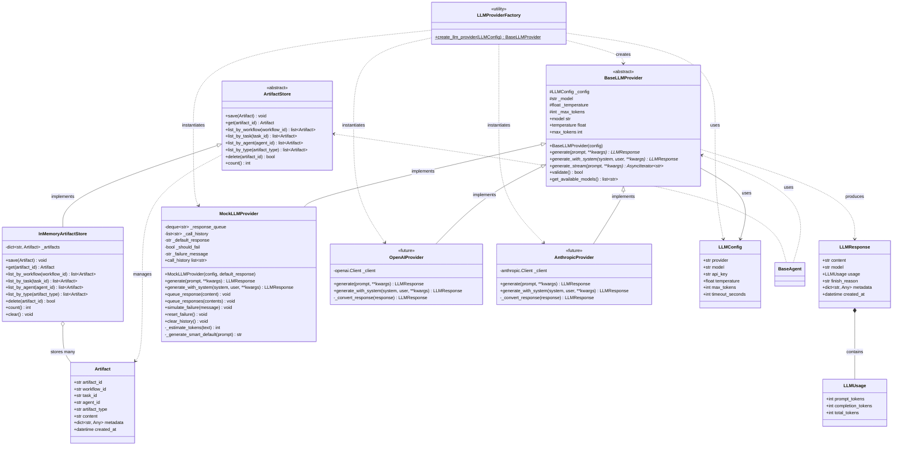

# Infrastructure & Integration Layer Class Diagram

This diagram shows the infrastructure (artifact storage) and integration (LLM providers) layers that support the ConductorAI framework.

## Class Diagram



## Infrastructure Layer

### Artifact Store
**Purpose**: Persistent storage for agent work products (code, tests, configs, reports).

**Artifact Types**:
- `code`: Source code generated by CodingAgent
- `test`: Test suites generated by TestAgent
- `test_data`: Test fixtures from TestDataAgent
- `review`: Code review reports from ReviewAgent
- `config`: CI/CD configurations from DevOpsAgent
- `deployment`: Deployment manifests from DeployingAgent
- `monitoring_report`: Monitoring analysis from MonitorAgent

**Storage Schema**:
```
artifact_id: "art-{uuid}"
  ├─ workflow_id: Links to workflow
  ├─ task_id: Links to specific task
  ├─ agent_id: Who produced it
  ├─ artifact_type: Category
  ├─ content: Actual artifact data
  ├─ metadata: {language, framework, version, ...}
  └─ created_at: Timestamp
```

**Implementations**:
- **InMemoryArtifactStore**: Dict-based, for dev/testing
- **RedisArtifactStore**: Redis-backed (future)
- **S3ArtifactStore**: S3 for large artifacts (future)

**Query Methods**:
- `list_by_workflow()`: All artifacts from a workflow
- `list_by_task()`: Artifacts from a specific task
- `list_by_agent()`: All work from one agent
- `list_by_type()`: Filter by artifact type

## Integration Layer

### LLM Provider Abstraction

**Purpose**: Abstract interface to LLM services, enabling provider swapping and testing.

**Key Benefits**:
1. **Swappability**: Switch providers via config
2. **Testability**: Use MockLLMProvider without API keys
3. **Consistency**: Standardized LLMResponse across all providers
4. **Observability**: Centralized token tracking and cost monitoring

### LLM Response Model

**LLMResponse Structure**:
```python
LLMResponse(
    content="...",           # Generated text
    model="gpt-4",          # Model identifier
    usage=LLMUsage(         # Token tracking
        prompt_tokens=50,
        completion_tokens=20,
        total_tokens=70
    ),
    finish_reason="stop",   # "stop", "length", "error"
    metadata={...}          # Provider-specific data
)
```

**Token Tracking (LLMUsage)**:
- Essential for cost tracking (most LLMs charge per token)
- Rate limit awareness
- Performance monitoring

### Provider Implementations

#### MockLLMProvider
**Purpose**: Testing and development without API keys.

**Features**:
- Response queue for controlled testing
- Smart defaults (generates contextual mock responses)
- Call history tracking for test assertions
- Token estimation based on text length
- Error simulation for testing failures

**Usage**:
```python
provider = MockLLMProvider()
provider.queue_response("Mocked code output")
response = await provider.generate("Write code")
assert response.content == "Mocked code output"
```

#### OpenAIProvider (Future)
**Purpose**: Integration with OpenAI GPT models.

**Features**:
- Supports GPT-3.5, GPT-4, and variants
- Streaming support for real-time generation
- Function calling integration
- Automatic retry with backoff

#### AnthropicProvider (Future)
**Purpose**: Integration with Anthropic Claude models.

**Features**:
- Supports Claude models
- System prompt support
- XML-style prompt formatting
- Long context handling

### Factory Pattern

**LLMProviderFactory**:
Maps provider names to concrete implementations:
```python
create_llm_provider(config) -> BaseLLMProvider
    "mock" → MockLLMProvider
    "openai" → OpenAIProvider
    "anthropic" → AnthropicProvider
```

**Usage**:
```python
config = LLMConfig(provider="mock")
provider = create_llm_provider(config)
response = await provider.generate("Hello")
```

## Agent Integration

### How Agents Use Infrastructure & Integration

```python
class CodingAgent(BaseAgent):
    def __init__(self, agent_id, config, llm_provider, artifact_store):
        self._llm = llm_provider
        self._artifacts = artifact_store
    
    async def _execute(self, task):
        # 1. Generate code using LLM
        response = await self._llm.generate_with_system(
            system="You are a coding expert",
            user=task.input_data["specification"]
        )
        
        # 2. Store artifact
        artifact = Artifact(
            workflow_id=task.metadata["workflow_id"],
            task_id=task.task_id,
            agent_id=self.agent_id,
            artifact_type="code",
            content=response.content,
            metadata={"language": "python", "tokens": response.usage.total_tokens}
        )
        await self._artifacts.save(artifact)
        
        # 3. Return result
        return TaskResult(
            task_id=task.task_id,
            agent_id=self.agent_id,
            status=TaskStatus.COMPLETED,
            output_data={
                "code": response.content,
                "artifact_id": artifact.artifact_id,
                "tokens_used": response.usage.total_tokens
            }
        )
```

## Design Patterns

### Strategy Pattern (LLM Providers)
- Each provider is a different strategy for LLM generation
- Swappable via dependency injection
- Same interface, different implementations

### Repository Pattern (Artifact Store)
- Abstract interface for artifact persistence
- Swappable backends (InMemory, Redis, S3)
- Consistent CRUD operations

### Factory Pattern (Provider Creation)
- Centralized provider instantiation
- Config-driven provider selection
- Reduces coupling in agent code

## Key Design Decisions

### Why Separate Artifact Store from State Manager?
- **Different data types**: Artifacts are large text blobs; state is structured metadata
- **Different access patterns**: Artifacts are write-once, read-many; state is frequently updated
- **Different backends**: Artifacts may use S3/blob storage; state uses Redis/DB

### Why Abstract LLM Providers?
- **Vendor lock-in avoidance**: Easy to switch providers
- **Cost optimization**: Test with different providers, use cheapest for production
- **Testing**: MockLLMProvider enables unit tests without API keys
- **Resilience**: Can fallback to different provider if one fails

### Why LLMResponse Standardization?
- **Consistent agent code**: Agents don't care about provider details
- **Token tracking**: Essential for cost monitoring across all providers
- **Metadata flexibility**: Provider-specific extras without breaking interface

## Future Enhancements

### Artifact Store
- **Redis backend**: Distributed artifact storage
- **S3 backend**: Large artifact storage (MB-GB range)
- **Compression**: Automatic compression for large artifacts
- **Versioning**: Track artifact history across workflow runs
- **Expiration**: TTL-based artifact cleanup

### LLM Providers
- **OpenAI integration**: Full GPT model support
- **Anthropic integration**: Claude model support
- **Streaming**: Real-time token-by-token generation
- **Caching**: Cache responses for identical prompts
- **Rate limiting**: Built-in rate limit handling
- **Cost tracking**: Per-agent, per-workflow cost analytics
