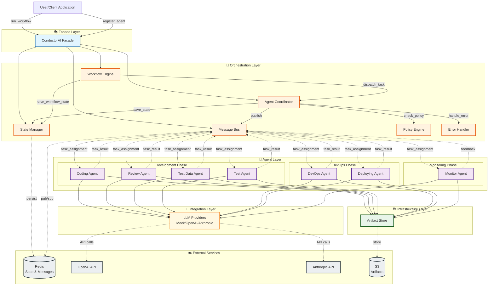
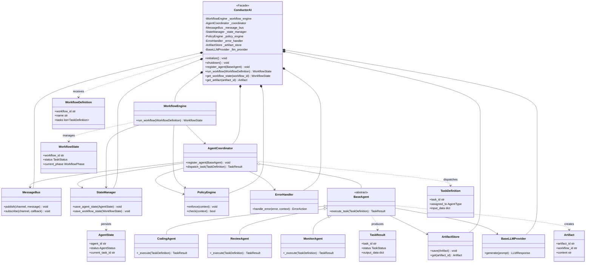
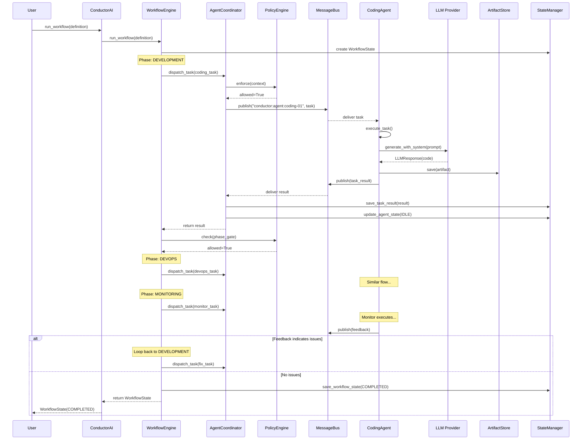

# System Architecture Overview

This diagram provides a complete view of the ConductorAI system architecture, showing how all layers interact.

## High-Level Architecture Diagram



## Detailed Component Diagram



## Workflow Execution Flow



## Layer Responsibilities

### 1. Facade Layer
**ConductorAI** - Single entry point
- System initialization and configuration
- Component lifecycle management
- High-level API for users
- Graceful shutdown

### 2. Orchestration Layer
**Workflow Engine** - Multi-phase execution
- Executes workflows phase by phase
- Manages phase transitions
- Handles feedback loops
- Coordinates task dependencies

**Agent Coordinator** - Agent registry & dispatcher
- Registers/unregisters agents
- Finds available agents by type
- Dispatches tasks to agents
- Syncs agent states

**Message Bus** - Pub/Sub communication
- Decouples agent communication
- Supports broadcast and direct messaging
- Request-response pattern
- Dead letter queue

**State Manager** - Persistence
- Stores agent states
- Stores workflow states
- Stores task results
- Supports Redis backend

**Policy Engine** - Rule enforcement
- Validates actions before execution
- Phase gate enforcement
- Concurrency limits
- Agent availability checks

**Error Handler** - Resilience
- Retry with exponential backoff
- Circuit breaker per agent
- Dead letter queue
- Error escalation

### 3. Agent Layer
**BaseAgent** - Abstract template
- Template Method pattern
- Lifecycle management
- State tracking
- Message handling

**Specialized Agents** - Domain experts
- **Development**: Coding, Review, TestData, Test
- **DevOps**: DevOps, Deploying
- **Monitoring**: Monitor

### 4. Infrastructure Layer
**Artifact Store** - Work products
- Stores code, tests, configs, reports
- Query by workflow/task/agent/type
- Supports multiple backends

### 5. Integration Layer
**LLM Providers** - AI integration
- Abstract interface
- Multiple providers (Mock, OpenAI, Anthropic)
- Token tracking
- Response standardization

## Data Flow Patterns

### 1. Task Execution Flow
```
WorkflowDefinition → WorkflowEngine → AgentCoordinator → MessageBus → Agent
Agent → LLM Provider → LLMResponse
Agent → Artifact Store → Artifact
Agent → MessageBus → TaskResult → StateManager
```

### 2. State Persistence Flow
```
Agent updates → AgentState → StateManager → Redis/Memory
Workflow progress → WorkflowState → StateManager → Redis/Memory
Task completion → TaskResult → StateManager → Redis/Memory
```

### 3. Feedback Loop Flow
```
MonitorAgent → analyzes deployment → FeedbackPayload → MessageBus
→ WorkflowEngine → loops back to DEVELOPMENT phase
→ CodingAgent → fixes issues → new code
```

### 4. Error Handling Flow
```
Agent error → ErrorHandler → check CircuitBreaker
→ is_open? → DEAD_LETTER
→ is_retryable? → RETRY with backoff
→ max_retries? → ESCALATE
```

## Key Design Principles

### 1. Separation of Concerns
Each layer has a single, well-defined responsibility:
- **Facade**: User interface
- **Orchestration**: Workflow coordination
- **Agents**: Domain-specific execution
- **Infrastructure**: Persistence
- **Integration**: External services

### 2. Dependency Inversion
High-level modules depend on abstractions:
- Agents depend on `BaseLLMProvider`, not OpenAI
- Coordinator depends on `MessageBus`, not Redis
- All components use abstract interfaces

### 3. Open/Closed Principle
- Add new agents without modifying orchestration
- Add new LLM providers without changing agents
- Add new policies without changing coordinator

### 4. Pub/Sub Decoupling
- Agents never call each other directly
- All communication through MessageBus
- Enables independent scaling and testing

### 5. Template Method Pattern
- BaseAgent defines execution skeleton
- Subclasses implement specific logic
- Consistent behavior across all agents

## Scalability Considerations

### Horizontal Scaling
- Multiple agent instances per type
- Load balancing via coordinator
- Shared state through Redis

### Vertical Scaling
- Configurable concurrency limits
- Policy-based resource management
- Circuit breakers prevent overload

### Performance Optimization
- Artifact caching
- LLM response caching
- Batch task processing
- Async I/O throughout

## Security & Reliability

### Security
- API key management via config
- Artifact access control (future)
- Message authentication (future)

### Reliability
- Retry with exponential backoff
- Circuit breakers per agent
- Dead letter queue
- State persistence
- Graceful degradation

## Configuration & Deployment

### Configuration Hierarchy
```
ConductorConfig
  ├─ LLMConfig (provider, model, API keys)
  ├─ RedisConfig (URL, connection pool)
  └─ Runtime settings (log level, timeouts)
```

### Deployment Options
1. **Development**: InMemory everything, Mock LLM
2. **Testing**: InMemory with real LLM providers
3. **Production**: Redis backend, OpenAI/Anthropic

This architecture provides a flexible, scalable, and maintainable foundation for multi-agent workflows!
