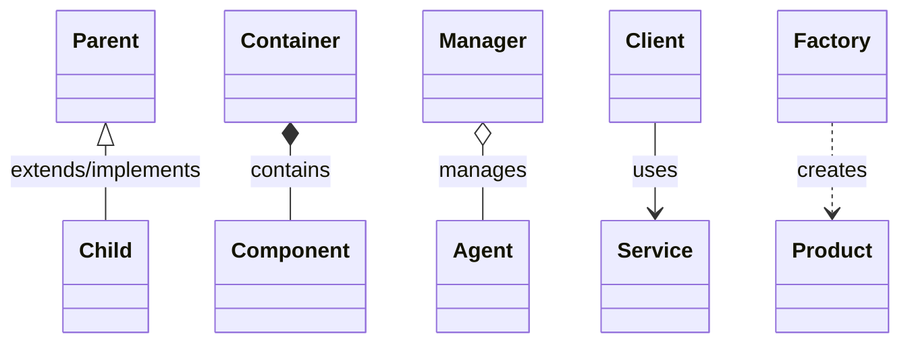
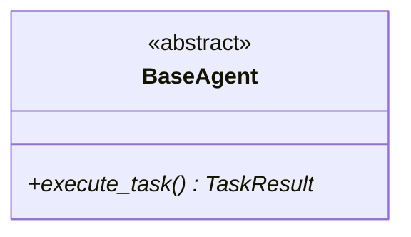
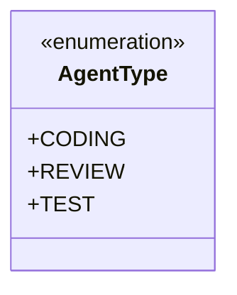
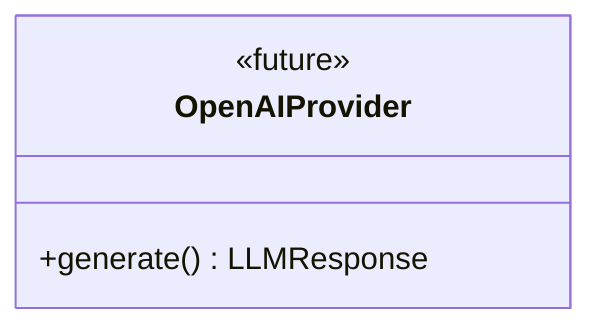

# ConductorAI Class Diagrams

This directory contains comprehensive class diagrams documenting the ConductorAI multi-agent framework architecture.

## 📋 Table of Contents

- [Overview](#overview)
- [Diagram Index](#diagram-index)
- [How to Use](#how-to-use)
- [Architecture Layers](#architecture-layers)
- [Reading the Diagrams](#reading-the-diagrams)
- [Contributing](#contributing)

## Overview

ConductorAI is a multi-agent orchestration framework that coordinates specialized AI agents through a complete software development lifecycle: Development → DevOps → Monitoring. These class diagrams provide detailed technical documentation of every component in the system.

## Diagram Index

### 1. [Core Models](./01-core-models.md)
**Foundation data structures that flow through every layer**

- **Models**: AgentIdentity, TaskDefinition, TaskResult, WorkflowDefinition
- **Messages**: AgentMessage and typed payloads (TaskAssignment, TaskResult, Feedback, Error, Status)
- **State**: AgentState, WorkflowState
- **Enums**: AgentType, AgentStatus, TaskStatus, WorkflowPhase, MessageType, Priority
- **Configuration**: ConductorConfig, RedisConfig, LLMConfig

**Key Concepts:**
- Immutable snapshots vs. dynamic state
- Pydantic validation and serialization
- Message envelope pattern

### 2. [Agent Layer](./02-agent-layer.md)
**Specialized agents and the base agent template**

- **BaseAgent**: Abstract template implementing Template Method pattern
- **Development Agents**: CodingAgent, ReviewAgent, TestDataAgent, TestAgent
- **DevOps Agents**: DevOpsAgent, DeployingAgent
- **Monitoring Agents**: MonitorAgent

**Key Concepts:**
- Template Method pattern (execute_task lifecycle)
- Strategy pattern (different _execute implementations)
- LLM integration via BaseLLMProvider
- Artifact generation and storage

### 3. [Orchestration Layer](./03-orchestration-layer.md)
**Workflow coordination, communication, state, policy, and error handling**

- **Message Bus**: Pub/Sub communication backbone (InMemory/Redis)
- **State Manager**: Persistence layer for states and results
- **Agent Coordinator**: Central registry and task dispatcher
- **Workflow Engine**: Multi-phase execution orchestrator
- **Policy Engine**: Rule enforcement gatekeeper
- **Error Handler**: Resilience layer (retry, circuit breaker, DLQ)

**Key Concepts:**
- Pub/Sub decoupling
- Phase-based workflow execution
- Policy enforcement before actions
- Three-layer error resilience (retry → circuit breaker → DLQ)

### 4. [Infrastructure & Integration](./04-infrastructure-integration.md)
**External service integrations and persistence**

- **Artifact Store**: Work product persistence (code, tests, configs, reports)
- **LLM Providers**: Abstract AI integration (Mock, OpenAI, Anthropic)
- **LLM Response**: Standardized response with token tracking

**Key Concepts:**
- Repository pattern (artifact storage)
- Strategy pattern (LLM providers)
- Factory pattern (provider creation)
- Token tracking for cost monitoring

### 5. [System Architecture](./05-system-architecture.md)
**Complete system overview showing all layers interacting**

- **High-level architecture diagram**: All layers and their relationships
- **Component diagram**: Detailed class relationships
- **Sequence diagram**: Complete workflow execution flow
- **Data flow patterns**: Task execution, state persistence, feedback loops

**Key Concepts:**
- Layer separation and dependencies
- End-to-end workflow execution
- Feedback loop mechanism
- Scalability and reliability patterns

## How to Use

### For New Developers
1. Start with [System Architecture](./05-system-architecture.md) for the big picture
2. Read [Core Models](./01-core-models.md) to understand the data structures
3. Study [Agent Layer](./02-agent-layer.md) to see how agents work
4. Explore [Orchestration Layer](./03-orchestration-layer.md) for workflow coordination
5. Review [Infrastructure & Integration](./04-infrastructure-integration.md) for external dependencies

### For Code Navigation
Each diagram includes:
- **Class diagrams**: Full class structures with methods and properties
- **Relationships**: Inheritance, composition, dependency, and association arrows
- **Usage examples**: Code snippets showing how components are used
- **Design patterns**: Explanation of patterns used and why

### For Architecture Reviews
- Compare your changes against the diagrams
- Update diagrams when adding new components
- Ensure new code follows established patterns

## Architecture Layers

ConductorAI follows a clean, layered architecture:

```
┌─────────────────────────────────────────────┐
│         🎭 Facade Layer                     │  User-facing API
│            ConductorAI                       │
├─────────────────────────────────────────────┤
│         🎼 Orchestration Layer              │  Workflow coordination
│   WorkflowEngine, Coordinator, MessageBus   │
│   StateManager, PolicyEngine, ErrorHandler  │
├─────────────────────────────────────────────┤
│         🤖 Agent Layer                      │  Domain-specific execution
│   CodingAgent, ReviewAgent, TestAgent,      │
│   DevOpsAgent, DeployingAgent, MonitorAgent │
├─────────────────────────────────────────────┤
│         🏗️ Infrastructure Layer             │  Persistence
│          ArtifactStore                       │
├─────────────────────────────────────────────┤
│         🔌 Integration Layer                │  External services
│          LLM Providers                       │
└─────────────────────────────────────────────┘
```

### Layer Responsibilities

**Facade Layer** (Top)
- Single entry point for users
- System initialization and shutdown
- High-level API: `run_workflow()`, `register_agent()`

**Orchestration Layer**
- Multi-phase workflow execution
- Agent coordination and task dispatch
- Message routing between components
- State persistence
- Policy enforcement
- Error handling and resilience

**Agent Layer**
- Specialized domain expertise
- LLM prompt engineering
- Task-specific validation and execution
- Artifact generation

**Infrastructure Layer**
- Artifact storage (code, tests, configs)
- Support for multiple backends (InMemory, Redis, S3)

**Integration Layer**
- LLM service abstraction
- Provider swapping (Mock, OpenAI, Anthropic)
- Response standardization

## Reading the Diagrams

### Mermaid Syntax
All diagrams use [Mermaid](https://mermaid.js.org/) syntax for easy rendering in:
- GitHub/GitLab
- VS Code (with Mermaid extension)
- Documentation sites (MkDocs, Docusaurus)
- Notion, Confluence, and other tools

### Relationship Symbols



**Legend:**
- `<|--` : **Inheritance** - Child extends Parent
- `*--` : **Composition** - Container owns Component (strong ownership)
- `o--` : **Aggregation** - Container has Component (weak ownership)
- `-->` : **Association** - Client uses Service
- `..>` : **Dependency** - Factory creates Product

### Common Patterns

#### Abstract Classes

Methods marked with `*` are abstract (must be implemented by subclasses).

#### Enumerations


#### Future Components

Components marked `<<future>>` are planned but not yet implemented.

## Design Patterns Used

### Creational Patterns
- **Factory Pattern**: `create_llm_provider()` creates providers based on config
- **Builder Pattern**: WorkflowDefinition construction

### Structural Patterns
- **Facade Pattern**: ConductorAI provides simplified interface to complex subsystems
- **Repository Pattern**: StateManager, ArtifactStore abstract persistence
- **Strategy Pattern**: Different LLM providers, different agent execution strategies

### Behavioral Patterns
- **Template Method**: BaseAgent.execute_task() defines skeleton, subclasses fill in
- **Pub/Sub**: MessageBus decouples agents from each other
- **Circuit Breaker**: ErrorHandler prevents cascading failures
- **Strategy**: Policy implementations, Error handling strategies

## Key Architectural Decisions

### 1. Why Separate MessageBus and StateManager?
- **Different access patterns**: Messages are fire-and-forget; state is read-heavy
- **Different durability**: State must persist; messages can be transient
- **Different backends**: State uses hashes; messages use pub/sub

### 2. Why Abstract LLM Providers?
- **Swappability**: Easy to switch between OpenAI, Anthropic, etc.
- **Testability**: MockLLMProvider for unit tests without API keys
- **Cost optimization**: Choose provider based on cost/performance

### 3. Why Template Method in BaseAgent?
- **Consistency**: All agents follow the same lifecycle
- **DRY**: Common logic (state transitions, error handling) in one place
- **Extensibility**: New agents only implement domain-specific logic

### 4. Why PolicyEngine as Separate Component?
- **Decoupling**: Rules separated from orchestration logic
- **Extensibility**: Add new policies without changing coordinator
- **Single Responsibility**: Each component has one job

### 5. Why Three-Layer Error Handling?
- **Defense in depth**: Retry → Circuit Breaker → Dead Letter Queue
- **Resilience**: Transient errors handled automatically
- **No data loss**: Failed tasks preserved in DLQ for investigation

## Contributing

When modifying the codebase:

1. **Update diagrams** when adding/changing components
2. **Follow existing patterns** shown in the diagrams
3. **Add examples** in the relevant diagram file
4. **Keep diagrams in sync** with code

### Diagram Update Checklist
- [ ] Updated class diagram with new classes/methods
- [ ] Updated relationships between components
- [ ] Added usage examples in documentation
- [ ] Updated sequence diagrams if flow changes
- [ ] Verified Mermaid syntax renders correctly

## Viewing the Diagrams

### In VS Code
Install the [Mermaid Preview extension](https://marketplace.visualstudio.com/items?itemName=vstirbu.vscode-mermaid-preview)

### In GitHub
Mermaid diagrams render automatically in Markdown files

### In Terminal
Use [mermaid-cli](https://github.com/mermaid-js/mermaid-cli):
```bash
npm install -g @mermaid-js/mermaid-cli
mmdc -i 01-core-models.md -o core-models.png
```

## Additional Resources

- [Main Documentation](../README.md)
- [System Architecture Overview](../sysarchitecture/architecture-overview.md)
- [Day-by-Day Build Guide](../day-01-foundations.md)
- [API Reference](../../src/conductor/)

## Questions?

For questions about the architecture or diagrams:
1. Check the [main README](../../readme.md)
2. Review the [architectural decision records](../hlddocs/)
3. Consult the inline code documentation

---

**Last Updated**: 2026-02-17  
**Maintainer**: ConductorAI Team  
**Diagrams Version**: 1.0.0
