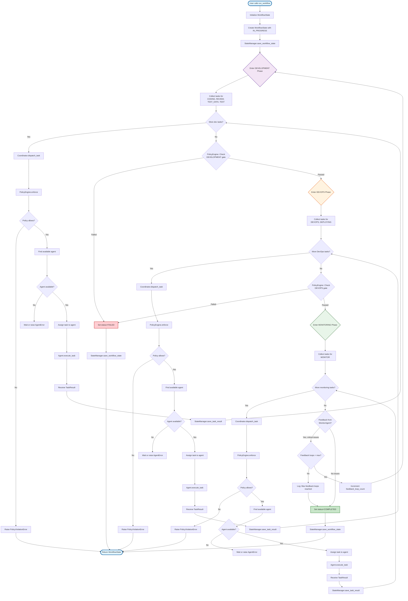
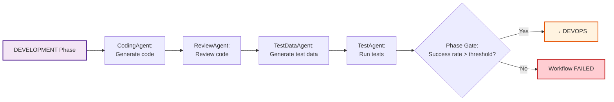
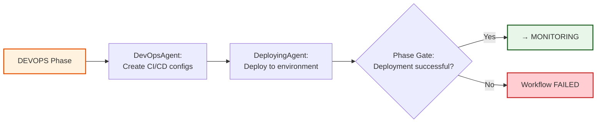
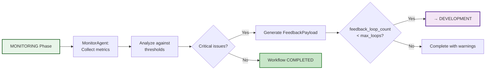
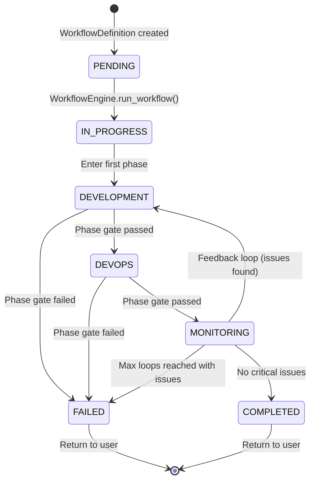
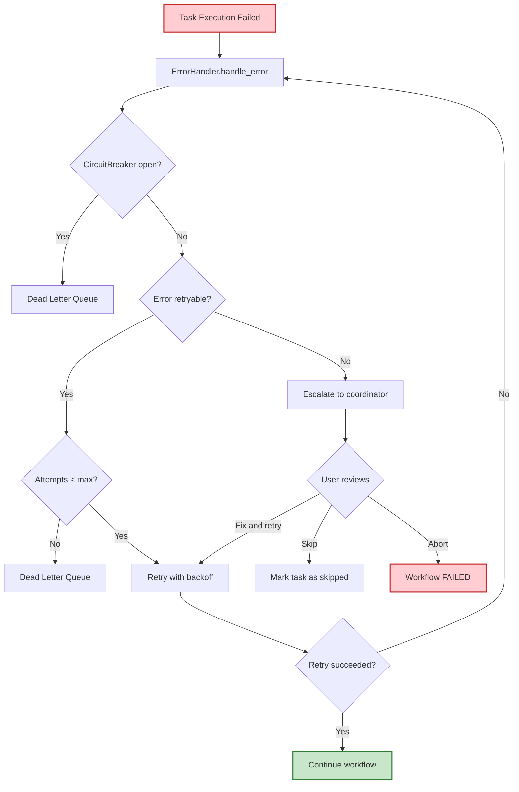
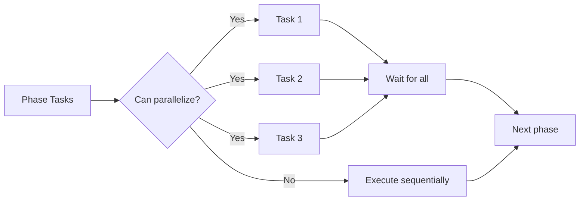

# Workflow Execution Flow

This diagram shows the complete flow of a workflow execution from start to finish, including all three phases and the feedback loop.

## Complete Workflow Execution Flow



## Phase Execution Details

### Development Phase


### DevOps Phase


### Monitoring Phase


## State Transitions



## Workflow State Properties

During execution, WorkflowState tracks:

```yaml
WorkflowState:
  workflow_id: "wf-abc-123"
  status: IN_PROGRESS | COMPLETED | FAILED
  current_phase: DEVELOPMENT | DEVOPS | MONITORING
  
  # Per-phase tracking
  pending_tasks: ["task-1", "task-2"]
  completed_tasks: ["task-0"]
  failed_tasks: []
  
  # Results by task ID
  task_results:
    "task-0":
      status: COMPLETED
      output_data: {...}
  
  # Agent states
  agent_states:
    "coding-01":
      status: IDLE
      completed_tasks: ["task-0"]
  
  # Feedback loop tracking
  feedback_loop_count: 0
  
  # Timing
  started_at: 2026-02-17T10:00:00Z
  completed_at: null
```

## Key Decision Points

### 1. Phase Gate Decisions
**Input**: Task results from current phase  
**Logic**: Check success rate against threshold  
**Output**: PASS → next phase, FAIL → workflow failed

Example:
```python
success_rate = completed_tasks / total_tasks
if success_rate < policy.min_success_rate:
    workflow.status = FAILED
else:
    workflow.current_phase = next_phase
```

### 2. Feedback Loop Decisions
**Input**: FeedbackPayload from MonitorAgent  
**Logic**: Check severity and loop count  
**Output**: Loop back or complete

Example:
```python
if feedback.severity in ["error", "critical"]:
    if workflow.feedback_loop_count < max_loops:
        workflow.feedback_loop_count += 1
        workflow.current_phase = DEVELOPMENT
    else:
        workflow.status = COMPLETED  # with warnings
else:
    workflow.status = COMPLETED
```

### 3. Agent Selection Decisions
**Input**: Task with agent_type requirement  
**Logic**: Find IDLE agent of correct type  
**Output**: Agent assignment or error

Example:
```python
available_agents = [
    a for a in agents 
    if a.agent_type == task.assigned_to 
    and a.status == IDLE
]
if not available_agents:
    raise AgentError("NO_AVAILABLE_AGENT")
selected = available_agents[0]
```

## Error Handling in Workflow



## Performance Characteristics

### Timing Expectations
- **Development Phase**: 30-120 seconds (LLM calls dominant)
- **DevOps Phase**: 10-30 seconds (config generation)
- **Monitoring Phase**: 5-15 seconds (metrics analysis)
- **Total Workflow**: 45-165 seconds (without feedback loops)

### With Feedback Loops
- **Single loop**: +60-180 seconds (re-run development)
- **Max loops (3)**: Up to 10+ minutes total

### Bottlenecks
1. **LLM API calls**: 5-15 seconds per generation
2. **Agent availability**: Waiting for IDLE agents
3. **Phase gates**: Policy evaluations are fast (<1ms)
4. **State persistence**: Redis writes are fast (<10ms)

## Optimization Opportunities

### Parallel Task Execution


### Caching
- **LLM responses**: Cache identical prompts
- **Artifacts**: Reuse from previous runs
- **Policy results**: Cache by context hash

This flow diagram shows the complete lifecycle of a workflow execution in ConductorAI!
