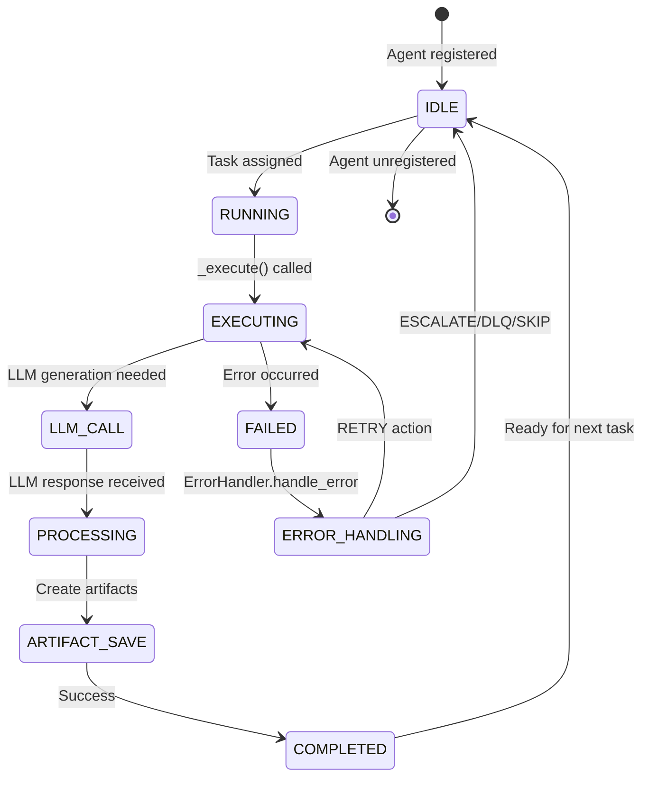
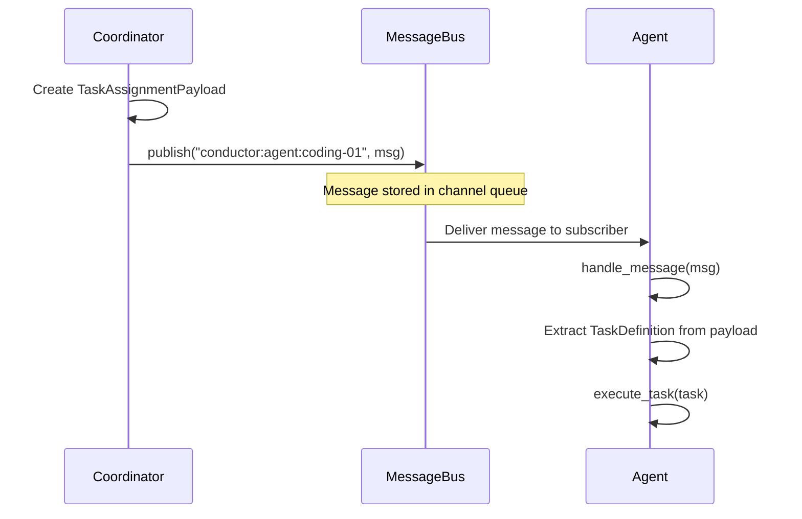
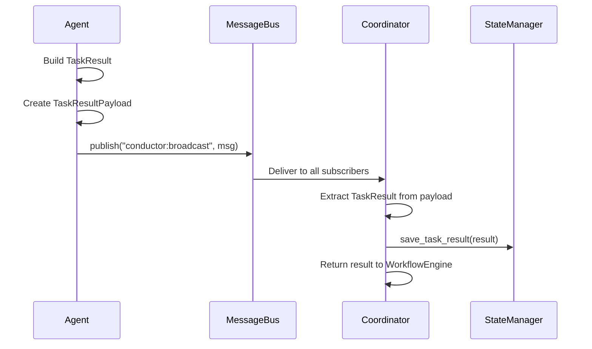
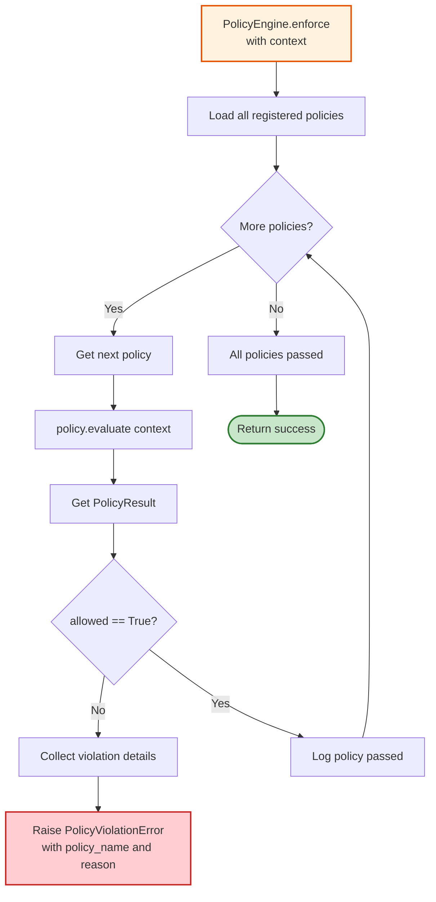
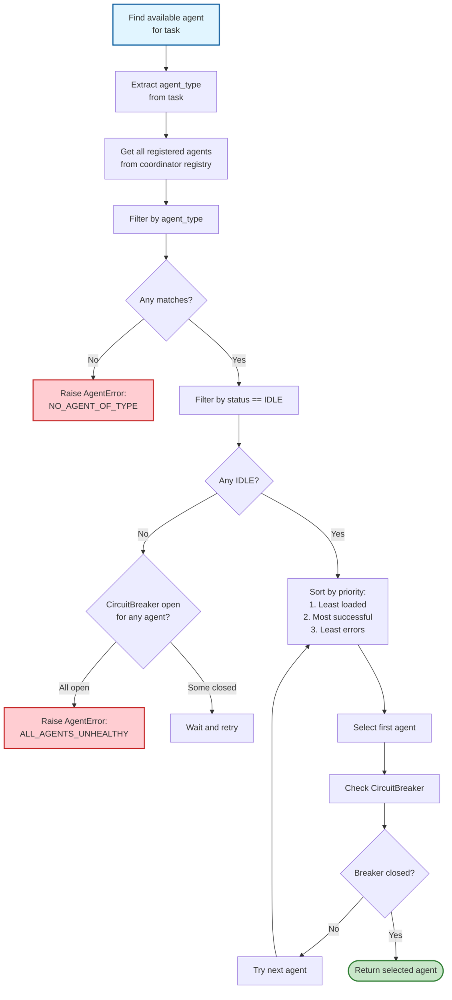
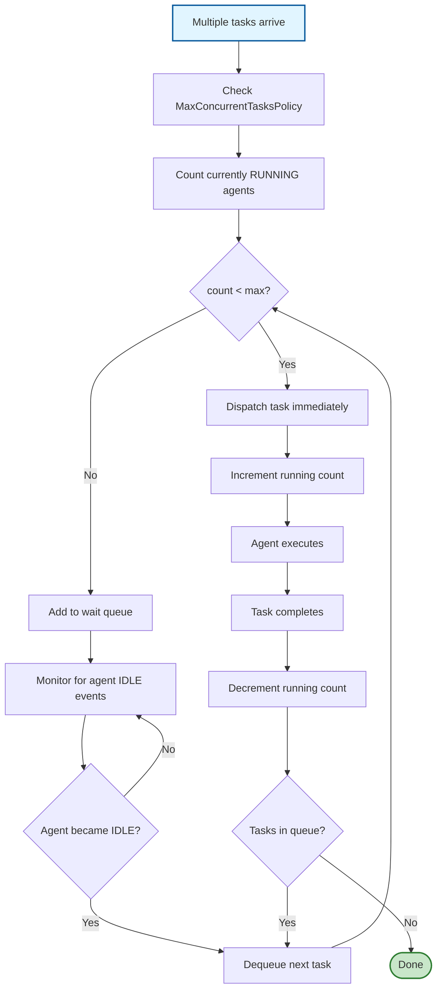
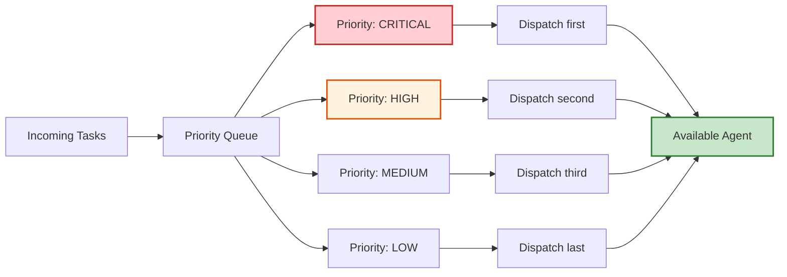
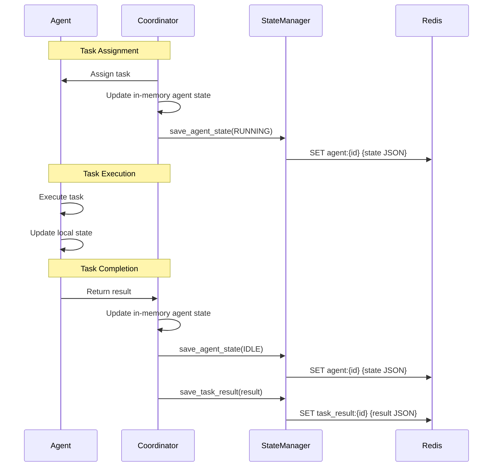
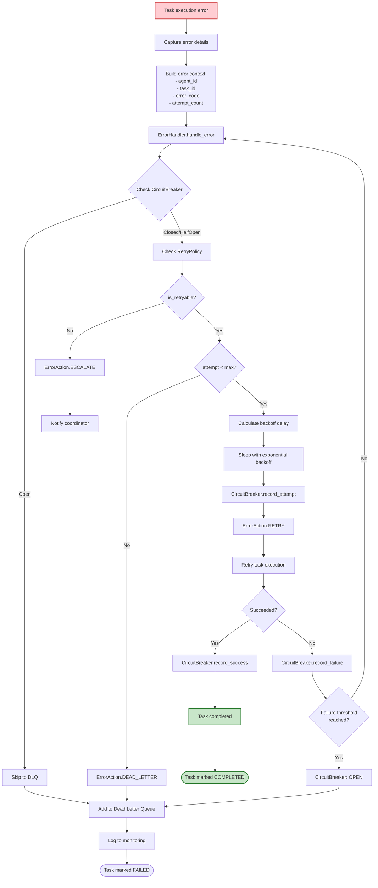

# Task Dispatch and Execution Flow

This diagram shows the detailed flow of task assignment from coordinator to agent and back.

## Complete Task Dispatch Flow

```mermaid
flowchart TD
    Start([Coordinator.dispatch_task<br/>called with TaskDefinition]) --> ValidateTask{Task valid?}
    
    ValidateTask -->|No| InvalidTask[Raise ValueError]
    ValidateTask -->|Yes| DetermineType[Determine target<br/>agent_type from task]
    
    DetermineType --> CheckPolicy[PolicyEngine.enforce<br/>with task context]
    CheckPolicy --> PolicyCheck{All policies pass?}
    PolicyCheck -->|No| PolicyFail[Raise PolicyViolationError]
    PolicyCheck -->|Yes| FindAgents[Get all agents of<br/>target agent_type]
    
    FindAgents --> FilterIdle[Filter agents with<br/>status == IDLE]
    FilterIdle --> AgentCheck{Any IDLE agents?}
    
    AgentCheck -->|No| WaitOrError{Retry enabled?}
    WaitOrError -->|No| NoAgent[Raise AgentError:<br/>NO_AVAILABLE_AGENT]
    WaitOrError -->|Yes| Wait[Wait 1 second]
    Wait --> Retry{Retry count < max?}
    Retry -->|Yes| FindAgents
    Retry -->|No| NoAgent
    
    AgentCheck -->|Yes| SelectAgent[Select first<br/>available agent]
    SelectAgent --> UpdateState1[Update agent state:<br/>status = RUNNING<br/>current_task_id = task.task_id]
    UpdateState1 --> SaveState1[StateManager.save_agent_state]
    
    SaveState1 --> CreateMessage[Create AgentMessage<br/>type = TASK_ASSIGNMENT<br/>payload = TaskAssignmentPayload]
    CreateMessage --> PublishTask[MessageBus.publish<br/>channel: conductor:agent:{agent_id}]
    
    PublishTask --> WaitForAgent[Wait for agent<br/>to process task...]
    
    WaitForAgent --> AgentReceives[Agent receives message<br/>via MessageBus subscription]
    AgentReceives --> AgentHandle[Agent.handle_message<br/>extracts TaskDefinition]
    AgentHandle --> AgentExecute[Agent.execute_task<br/>Template Method]
    
    %% Agent execution details
    AgentExecute --> Validate[Agent._validate_task]
    Validate --> ValidCheck{Task valid for<br/>this agent?}
    ValidCheck -->|No| ValidationFail[Raise AgentError:<br/>TASK_VALIDATION_FAILED]
    ValidCheck -->|Yes| SetRunning[Update status to RUNNING]
    
    SetRunning --> Execute[Agent._execute<br/>Core agent logic]
    Execute --> LLMCall{Needs LLM?}
    LLMCall -->|Yes| CallLLM[LLMProvider.generate]
    CallLLM --> ProcessLLM[Process LLM response]
    ProcessLLM --> CreateArtifact
    LLMCall -->|No| CreateArtifact[Create artifacts]
    
    CreateArtifact --> SaveArtifact[ArtifactStore.save]
    SaveArtifact --> BuildResult[Build TaskResult<br/>status = COMPLETED<br/>output_data = {...}]
    
    BuildResult --> UpdateState2[Update agent state:<br/>status = IDLE<br/>completed_tasks += task_id]
    UpdateState2 --> SaveState2[StateManager.save_agent_state]
    
    SaveState2 --> CreateResponse[Create AgentMessage<br/>type = TASK_RESULT<br/>payload = TaskResultPayload]
    CreateResponse --> PublishResult[MessageBus.publish<br/>channel: conductor:broadcast]
    
    PublishResult --> CoordReceives[Coordinator receives<br/>task result message]
    CoordReceives --> SaveTaskResult[StateManager.save_task_result]
    SaveTaskResult --> ReturnResult([Return TaskResult<br/>to WorkflowEngine])
    
    %% Error paths
    Execute --> ExecuteError{Error during<br/>execution?}
    ExecuteError -->|Yes| ErrorHandler[ErrorHandler.handle_error]
    ErrorHandler --> ErrorAction{What action?}
    ErrorAction -->|RETRY| RetryTask[Retry task after backoff]
    RetryTask --> Execute
    ErrorAction -->|ESCALATE| EscalateError[Publish error message<br/>to coordinator]
    ErrorAction -->|DEAD_LETTER| DLQ[Add to Dead Letter Queue]
    ErrorAction -->|SKIP| SkipTask[Mark task as skipped]
    
    EscalateError --> BuildFailResult[Build TaskResult<br/>status = FAILED<br/>error_message = ...]
    DLQ --> BuildFailResult
    SkipTask --> BuildFailResult
    BuildFailResult --> UpdateState3[Update agent state:<br/>status = IDLE<br/>failed_tasks += task_id]
    UpdateState3 --> SaveState3[StateManager.save_agent_state]
    SaveState3 --> CreateFailResponse[Create error message]
    CreateFailResponse --> PublishFail[MessageBus.publish]
    PublishFail --> CoordReceives
    
    ValidationFail --> BuildFailResult
    
    InvalidTask --> End([End])
    PolicyFail --> End
    NoAgent --> End
    ReturnResult --> End
    
    style Start fill:#e1f5ff,stroke:#01579b,stroke-width:3px
    style End fill:#e1f5ff,stroke:#01579b,stroke-width:3px
    style Execute fill:#fff3e0,stroke:#e65100,stroke-width:2px
    style ReturnResult fill:#c8e6c9,stroke:#2e7d32,stroke-width:2px
    style PolicyFail fill:#ffcdd2,stroke:#c62828,stroke-width:2px
    style NoAgent fill:#ffcdd2,stroke:#c62828,stroke-width:2px
```

## Agent Task Execution Lifecycle



## Message Flow Detail

### Task Assignment Message


### Task Result Message


## Policy Enforcement Detail



## Agent Selection Algorithm



## Concurrent Task Handling



## Task Priority Handling



## State Synchronization



## Error Recovery Flow



## Performance Metrics

### Task Dispatch Latency
```
Policy check: < 1ms
Agent lookup: < 5ms
State save: 5-10ms (InMemory) | 10-50ms (Redis)
Message publish: < 5ms (InMemory) | 10-50ms (Redis)
---
Total: ~20-100ms
```

### Agent Execution Time
```
Validation: < 1ms
LLM call: 5-15 seconds (dominant)
Artifact save: 5-20ms
State update: 5-10ms
Result publish: < 5ms
---
Total: ~5-15 seconds (LLM dependent)
```

### Task Throughput
```
Sequential: ~4-12 tasks/minute (LLM bottleneck)
Parallel (5 agents): ~20-60 tasks/minute
Parallel (10 agents): ~40-120 tasks/minute
```

This flow diagram details the complete task dispatch and execution lifecycle in ConductorAI!
