# Message Routing Flow

This diagram shows how messages flow through the MessageBus and get routed to the correct subscribers.

## Message Bus Architecture

```mermaid
flowchart TD
    Start([Component wants to<br/>send message]) --> CreateMsg[Create AgentMessage]
    CreateMsg --> SetFields[Set fields:<br/>- message_type<br/>- sender_id<br/>- recipient_id<br/>- payload<br/>- priority]
    
    SetFields --> DetermineChannel{Determine channel}
    DetermineChannel -->|Direct message| DirectChannel[Channel: conductor:agent:{agent_id}]
    DetermineChannel -->|Broadcast| BroadcastChannel[Channel: conductor:broadcast]
    DetermineChannel -->|Phase message| PhaseChannel[Channel: conductor:phase:{phase}]
    DetermineChannel -->|Workflow message| WorkflowChannel[Channel: conductor:workflow:{id}]
    
    DirectChannel --> Publish[MessageBus.publish channel, message]
    BroadcastChannel --> Publish
    PhaseChannel --> Publish
    WorkflowChannel --> Publish
    
    Publish --> CheckTTL{Message has TTL?}
    CheckTTL -->|Yes| SetExpiry[Set expiration time]
    CheckTTL -->|No| NoExpiry[No expiration]
    SetExpiry --> Store
    NoExpiry --> Store[Store message in channel]
    
    Store --> FindSubscribers[Find all subscribers<br/>on this channel]
    FindSubscribers --> HasSubs{Has subscribers?}
    HasSubs -->|No| LogNoSubs[Log: No subscribers]
    HasSubs -->|Yes| IterateSubs[For each subscriber]
    
    IterateSubs --> CheckExpired{Message expired?}
    CheckExpired -->|Yes| DropMsg[Drop message]
    CheckExpired -->|No| CallCallback[Call subscriber callback<br/>with message]
    
    CallCallback --> AsyncExec[Execute callback asynchronously]
    AsyncExec --> HandleError{Callback error?}
    HandleError -->|Yes| LogError[Log callback error]
    HandleError -->|No| Success[Callback completed]
    
    LogError --> NextSub{More subscribers?}
    Success --> NextSub
    NextSub -->|Yes| IterateSubs
    NextSub -->|No| Complete[All subscribers notified]
    
    Complete --> Cleanup[Cleanup expired messages]
    Cleanup --> End([Message delivered])
    LogNoSubs --> End
    DropMsg --> End
    
    style Start fill:#e1f5ff,stroke:#01579b,stroke-width:3px
    style End fill:#c8e6c9,stroke:#2e7d32,stroke-width:2px
    style DropMsg fill:#ffcdd2,stroke:#c62828,stroke-width:2px
```

## Channel Naming Convention

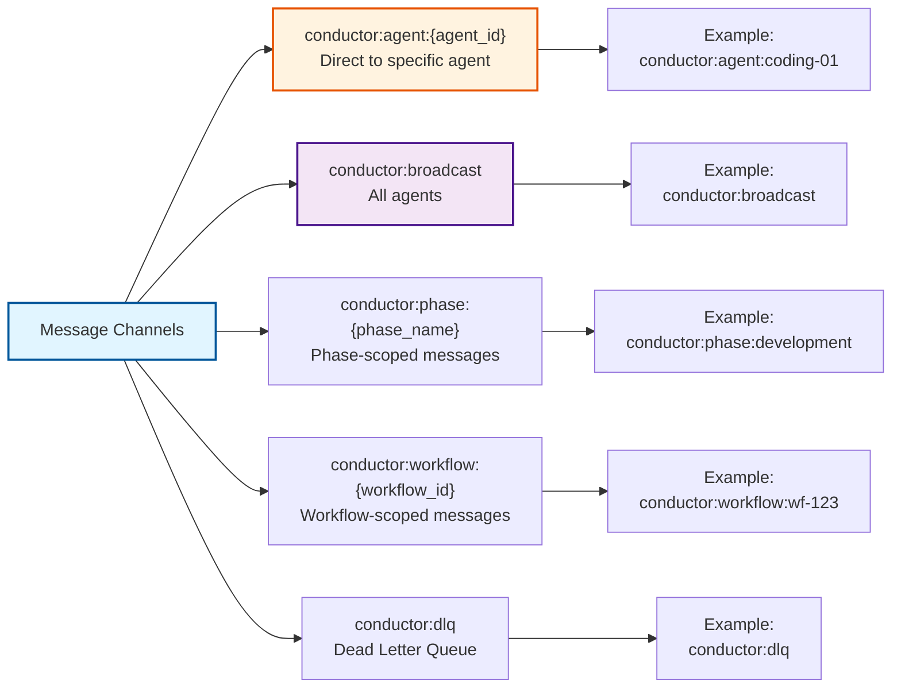

## Pub/Sub Pattern Flow

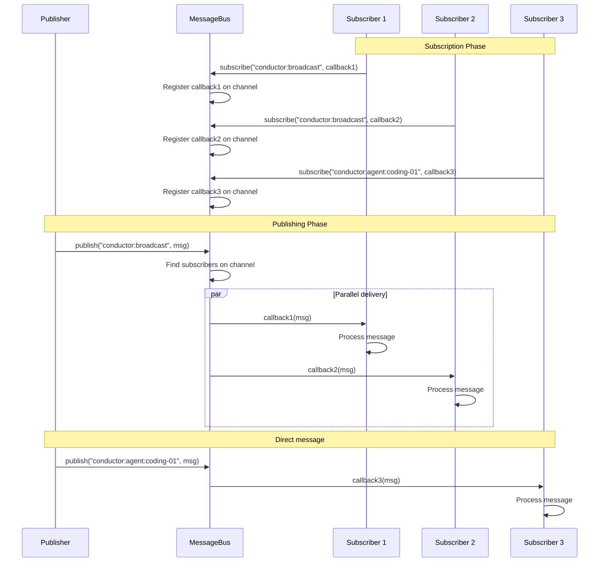

## Request-Response Pattern

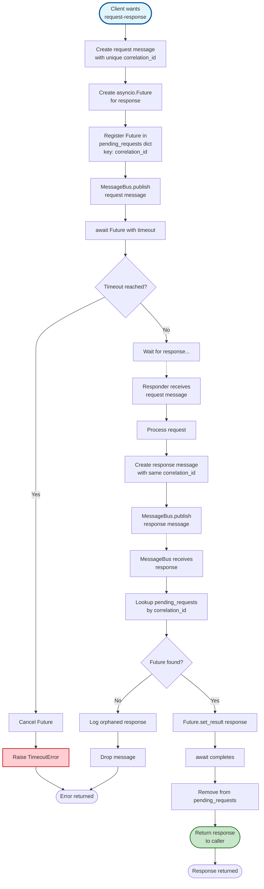

## Message Priority Handling

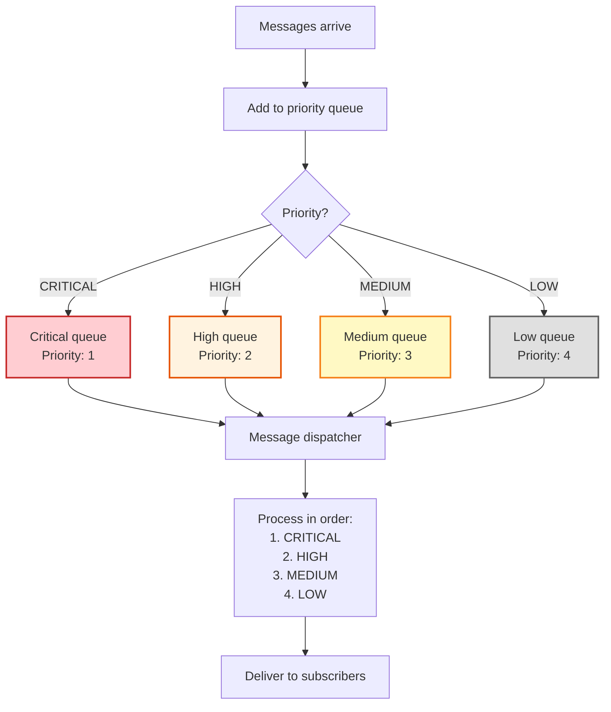

## Message Deduplication

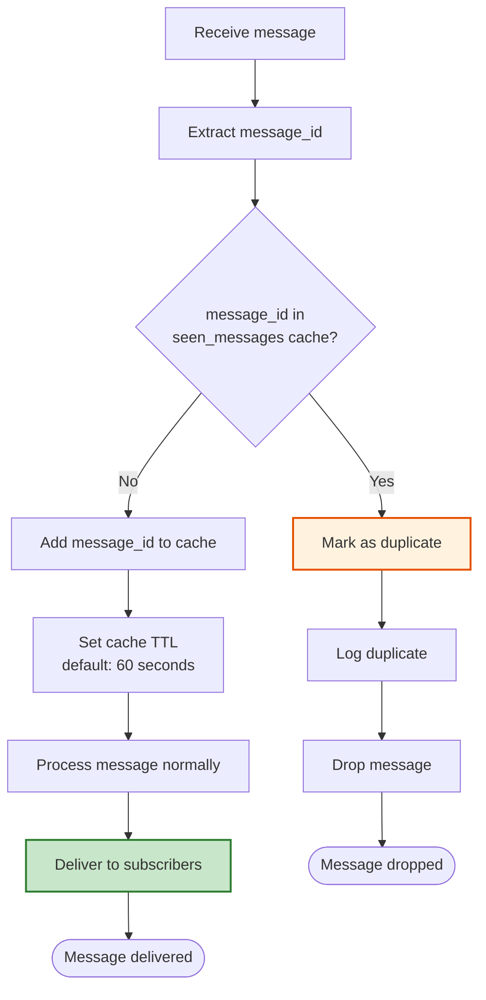

## Dead Letter Queue Flow

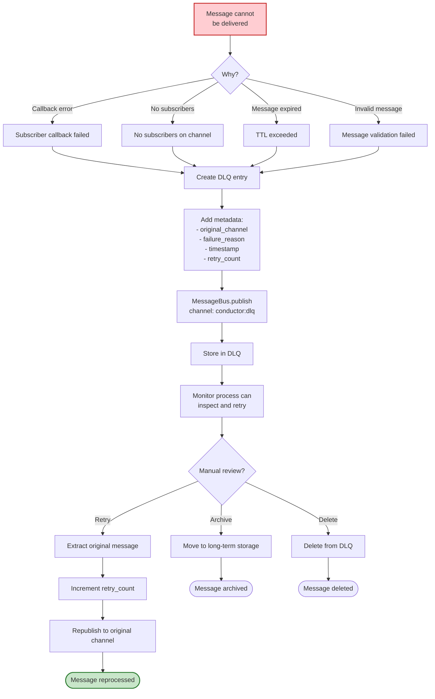

## Subscription Management

```mermaid
flowchart TD
    Start([Component wants to<br/>receive messages]) --> Subscribe[MessageBus.subscribe<br/>channel, callback]
    Subscribe --> ValidateChannel{Valid channel?}
    
    ValidateChannel -->|No| InvalidChannel[Raise ValueError]
    ValidateChannel -->|Yes| ValidateCallback{Valid callback?}
    
    ValidateCallback -->|No| InvalidCallback[Raise ValueError]
    ValidateCallback -->|Yes| CheckExists{Callback already<br/>subscribed?}
    
    CheckExists -->|Yes| LogDuplicate[Log duplicate subscription]
    CheckExists -->|No| AddSubscription[Add to subscriptions dict<br/>channel -> [callbacks]]
    
    AddSubscription --> RegisterCleanup[Register cleanup on disconnect]
    RegisterCleanup --> Active[Subscription active]
    
    Active --> ReceiveMsg[Receive messages...]
    
    ReceiveMsg --> Unsubscribe{Want to unsubscribe?}
    Unsubscribe -->|Yes| Remove[MessageBus.unsubscribe<br/>channel, callback]
    Remove --> RemoveFromDict[Remove from subscriptions dict]
    RemoveFromDict --> CheckEmpty{Channel has<br/>other subscribers?}
    CheckEmpty -->|No| CleanupChannel[Remove channel entry]
    CheckEmpty -->|Yes| KeepChannel[Keep channel active]
    
    CleanupChannel --> End([Unsubscribed])
    KeepChannel --> End
    LogDuplicate --> End2([Subscription exists])
    InvalidChannel --> End3([Error])
    InvalidCallback --> End3
    
    style Start fill:#e1f5ff,stroke:#01579b,stroke-width:3px
    style Active fill:#c8e6c9,stroke:#2e7d32,stroke-width:2px
    style End fill:#c8e6c9,stroke:#2e7d32,stroke-width:2px
```

## Message Correlation

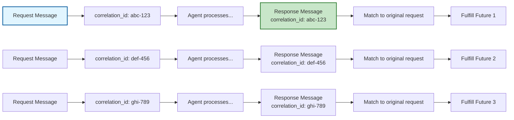

## Message State Diagram

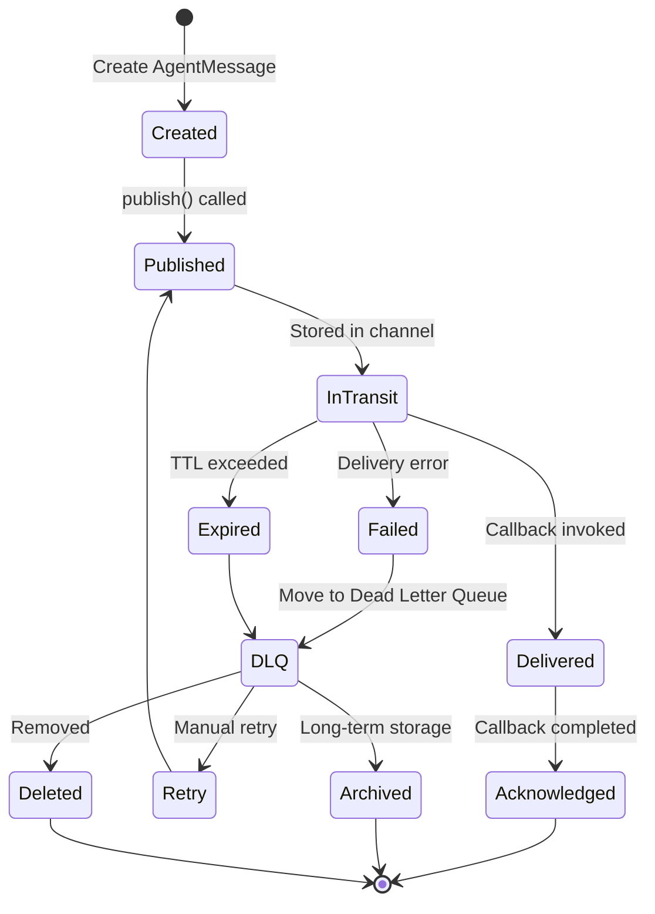

## Message Flow Patterns

### 1. Coordinator → Agent (Task Assignment)
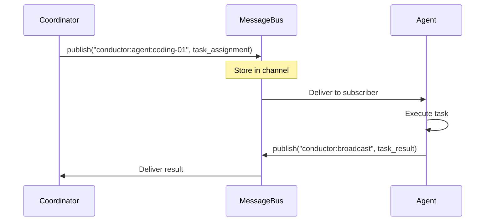

### 2. Monitor → Coordinator (Feedback)
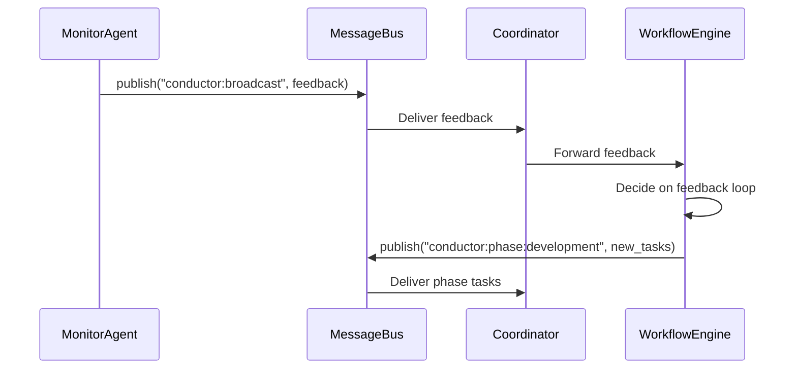

### 3. Error → Dead Letter Queue
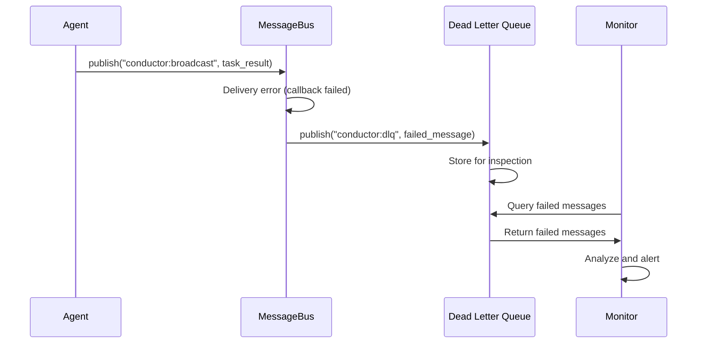

## Performance Characteristics

### Message Latency (InMemory)
```
Publish: < 1ms
Subscription lookup: < 1ms
Callback invocation: < 1ms
Total: < 5ms
```

### Message Latency (Redis Pub/Sub)
```
Publish to Redis: 5-20ms
Redis to subscribers: 5-20ms
Callback invocation: < 1ms
Total: 10-50ms
```

### Throughput
```
InMemory: 100,000+ messages/second
Redis: 10,000-50,000 messages/second
```

### Backpressure Handling
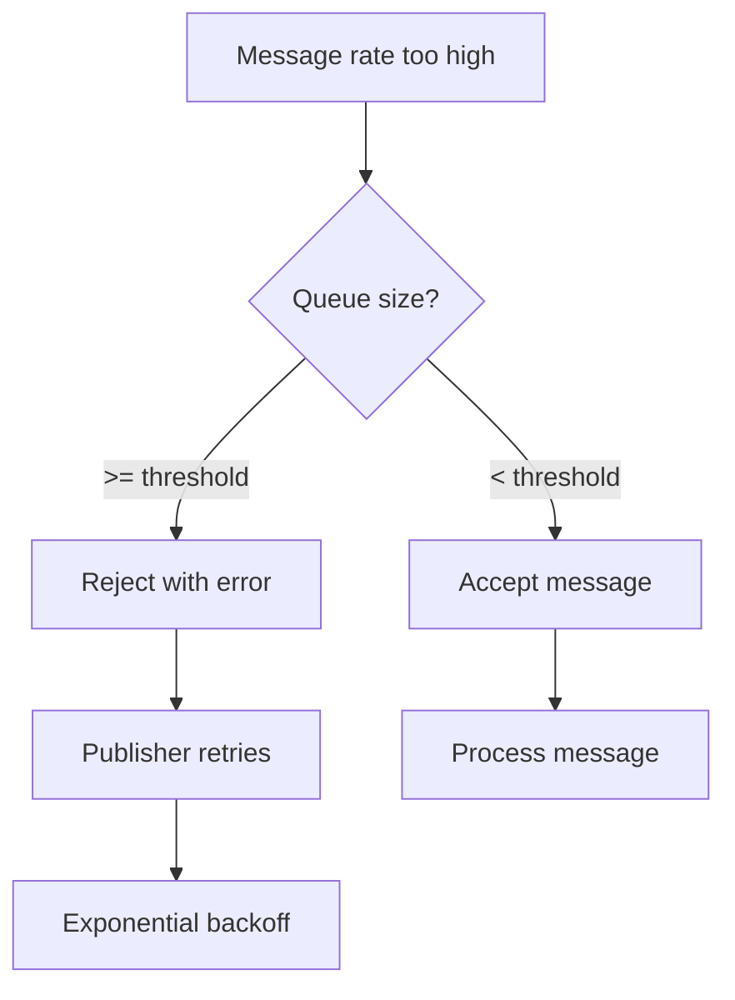

This flow diagram details the complete message routing system in ConductorAI!
