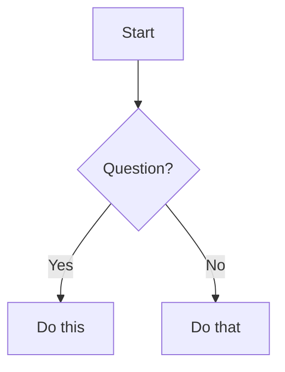
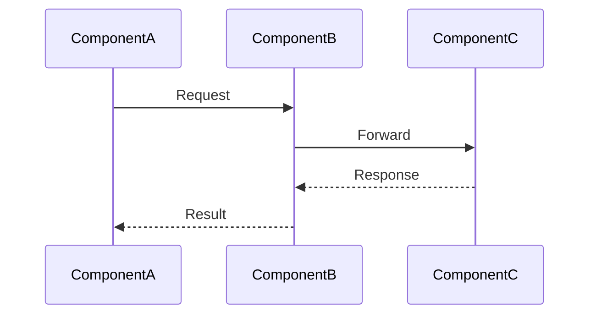
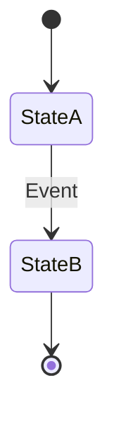
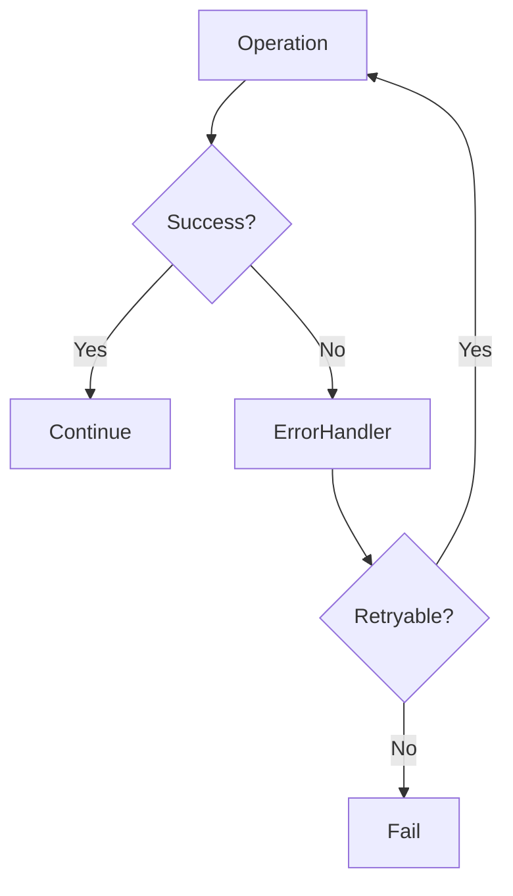
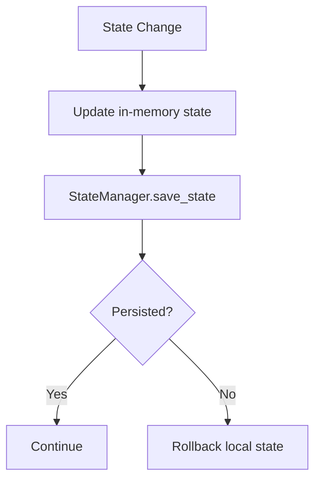
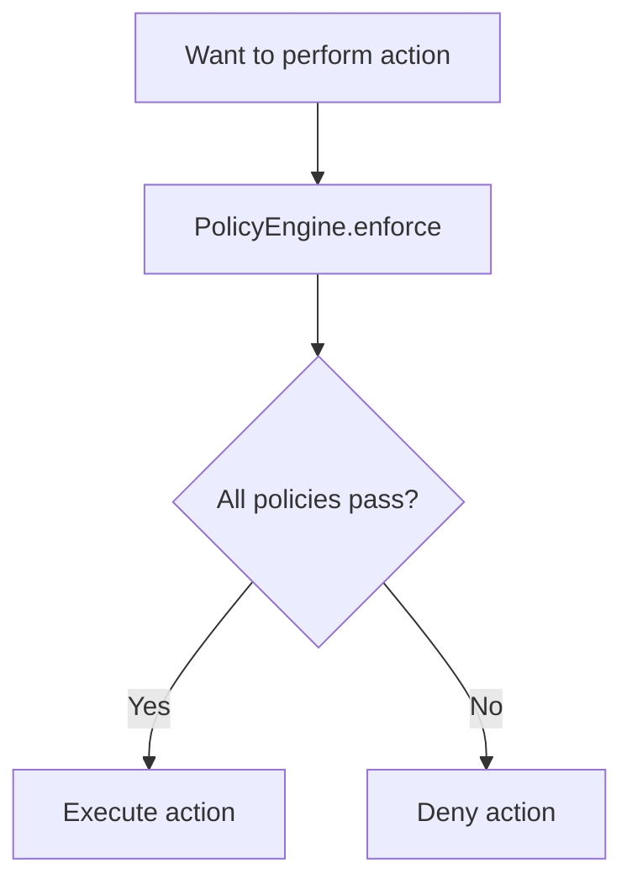

# ConductorAI Flow Diagrams

This directory contains detailed flow diagrams showing runtime behavior and data flow through the ConductorAI system.

## 📋 Overview

While [class diagrams](../classdiagram/) show the **static structure** (classes, relationships, interfaces), these flow diagrams show the **dynamic behavior** (how components interact at runtime, how data flows, how decisions are made).

## 📁 Flow Diagram Index

### 1. [Workflow Execution Flow](./01-workflow-execution-flow.md)
**Complete end-to-end workflow lifecycle**

Shows:
- Full workflow execution from start to finish
- All three phases: DEVELOPMENT → DEVOPS → MONITORING
- Phase transition logic and gates
- Feedback loop mechanism
- State transitions (PENDING → IN_PROGRESS → COMPLETED/FAILED)
- Error handling at workflow level
- Performance characteristics and timing

**Use this when:**
- Understanding the complete pipeline
- Debugging workflow failures
- Optimizing phase transitions
- Planning workflow enhancements

### 2. [Task Dispatch and Execution Flow](./02-task-dispatch-flow.md)
**Detailed task assignment and execution**

Shows:
- Task dispatch from coordinator to agent
- Policy enforcement before dispatch
- Agent selection algorithm
- Agent task execution lifecycle
- LLM integration and artifact creation
- State synchronization flow
- Error recovery mechanisms
- Concurrent task handling

**Use this when:**
- Understanding task assignments
- Debugging agent selection issues
- Optimizing task execution
- Implementing new agent types

### 3. [Message Routing Flow](./03-message-routing-flow.md)
**Complete message bus communication**

Shows:
- Message creation and publishing
- Channel naming and routing
- Pub/Sub pattern implementation
- Request-Response pattern
- Message priority handling
- Dead Letter Queue flow
- Subscription management
- Message correlation

**Use this when:**
- Understanding inter-component communication
- Debugging message delivery issues
- Implementing new channels
- Optimizing message throughput

## 🎯 How to Use These Diagrams

### For Learning
1. **Start with Workflow Execution** to understand the big picture
2. **Study Task Dispatch** to see how work gets assigned
3. **Review Message Routing** to understand communication

### For Development
- **Before coding**: Review relevant flow to understand expected behavior
- **During coding**: Use as reference for implementing logic
- **After coding**: Verify your implementation follows the flows

### For Debugging
1. **Identify the failing component** (workflow, task, message)
2. **Open the relevant flow diagram**
3. **Trace the execution path** to find where it diverges
4. **Check state at each decision point**

### For Optimization
- **Identify bottlenecks** in the flow
- **Find parallel execution opportunities**
- **Locate caching opportunities**
- **Spot redundant operations**

## 🔄 Relationship to Class Diagrams

| Flow Diagram | Related Class Diagrams | Connection |
|-------------|----------------------|------------|
| Workflow Execution | [Orchestration](../classdiagram/03-orchestration-layer.md), [Agents](../classdiagram/02-agent-layer.md) | Shows how WorkflowEngine and AgentCoordinator interact |
| Task Dispatch | [Orchestration](../classdiagram/03-orchestration-layer.md), [Agents](../classdiagram/02-agent-layer.md) | Details AgentCoordinator dispatch algorithm |
| Message Routing | [Core Models](../classdiagram/01-core-models.md), [Orchestration](../classdiagram/03-orchestration-layer.md) | Shows MessageBus and AgentMessage in action |

## 📊 Diagram Types Used

### Flowcharts
Show step-by-step processes with decision points:


### Sequence Diagrams
Show interactions between components over time:


### State Diagrams
Show state transitions:


## 🔍 Key Patterns Illustrated

### 1. Template Method (Agent Execution)
All agents follow the same execution template:
```
validate → set_running → execute → set_completed/failed
```
See: [Task Dispatch Flow - Agent Execution Lifecycle](./02-task-dispatch-flow.md#agent-task-execution-lifecycle)

### 2. Pub/Sub (Message Bus)
Publishers and subscribers are decoupled:
```
Publisher → Channel → [Subscriber1, Subscriber2, ...]
```
See: [Message Routing Flow - Pub/Sub Pattern](./03-message-routing-flow.md#pubsub-pattern-flow)

### 3. Circuit Breaker (Error Handling)
Prevents cascading failures:
```
Failures → Open Circuit → Recovery Timeout → Half-Open → Test → Close/Reopen
```
See: [Task Dispatch Flow - Error Recovery](./02-task-dispatch-flow.md#error-recovery-flow)

### 4. Request-Response (Synchronous over Async)
Async request-response using correlation IDs:
```
Request(correlation_id) → Process → Response(same correlation_id)
```
See: [Message Routing Flow - Request-Response Pattern](./03-message-routing-flow.md#request-response-pattern)

### 5. Feedback Loop (Monitoring)
Continuous improvement through monitoring:
```
Deploy → Monitor → Issues? → Fix → Deploy → Monitor
```
See: [Workflow Execution Flow - Feedback Loop](./01-workflow-execution-flow.md#feedback-loop)

## 📈 Performance Insights

Each flow diagram includes performance characteristics:

### Workflow Execution
- **Single workflow**: 45-165 seconds
- **With feedback loops**: Up to 10+ minutes
- **Bottleneck**: LLM API calls (5-15s each)

### Task Dispatch
- **Dispatch latency**: 20-100ms
- **Execution time**: 5-15 seconds (LLM-dependent)
- **Throughput**: 4-12 tasks/minute (sequential), 20-60 (5 parallel agents)

### Message Routing
- **InMemory latency**: <5ms
- **Redis latency**: 10-50ms
- **Throughput**: 100k+ msg/s (InMemory), 10-50k msg/s (Redis)

## 🎨 Color Coding

Consistent color scheme across all diagrams:

- 🔵 **Blue**: Start/End points, user interactions
- 🟣 **Purple**: Development phase components
- 🟠 **Orange**: DevOps phase components
- 🟢 **Green**: Monitoring phase, success states
- 🔴 **Red**: Error states, failures
- 🟡 **Yellow**: Warnings, waiting states

## 🔧 Common Flow Patterns

### Error Handling Pattern


### State Persistence Pattern


### Policy Check Pattern


## 🚀 Quick Reference

### Finding Specific Flows

**How does a workflow execute?**
→ [Workflow Execution Flow](./01-workflow-execution-flow.md)

**How are tasks assigned to agents?**
→ [Task Dispatch Flow - Agent Selection](./02-task-dispatch-flow.md#agent-selection-algorithm)

**How do agents communicate?**
→ [Message Routing Flow - Pub/Sub](./03-message-routing-flow.md#pubsub-pattern-flow)

**What happens when an error occurs?**
→ [Task Dispatch Flow - Error Recovery](./02-task-dispatch-flow.md#error-recovery-flow)

**How does the feedback loop work?**
→ [Workflow Execution Flow - Monitoring Phase](./01-workflow-execution-flow.md#monitoring-phase)

**How are messages prioritized?**
→ [Message Routing Flow - Priority Handling](./03-message-routing-flow.md#message-priority-handling)

**How do phases transition?**
→ [Workflow Execution Flow - Phase Gates](./01-workflow-execution-flow.md#phase-execution-details)

**How is state synchronized?**
→ [Task Dispatch Flow - State Sync](./02-task-dispatch-flow.md#state-synchronization)

## 🔗 Related Documentation

- **Class Diagrams**: [../classdiagram/](../classdiagram/) - Static structure
- **Architecture Overview**: [../sysarchitecture/](../sysarchitecture/) - System design
- **Day-by-Day Guide**: [../day-01-foundations.md](../day-01-foundations.md) - Build progression
- **API Reference**: [../../src/conductor/](../../src/conductor/) - Code documentation

## 💡 Tips for Reading Flow Diagrams

### 1. Follow the Arrows
- Solid arrows: Direct flow
- Dashed arrows: Async/indirect flow
- Diamond shapes: Decision points
- Rectangular shapes: Actions/processes

### 2. Identify Decision Points
Look for diamonds (`{...}`) - these are where logic branches

### 3. Trace Error Paths
Red-colored flows typically show error handling

### 4. Note State Changes
Look for state updates (boxes mentioning "status", "state")

### 5. Understand Timing
Some diagrams include timing annotations (ms, seconds)

## 🛠️ Extending the Flow Diagrams

When adding new features:

1. **Identify affected flows**
2. **Update decision points** if logic changes
3. **Add new paths** for new behaviors
4. **Update timing estimates** if performance changes
5. **Add examples** for complex flows
6. **Verify Mermaid syntax** renders correctly

### Flow Update Checklist
- [ ] Updated flowchart with new steps
- [ ] Added decision points for new logic
- [ ] Updated state transitions if applicable
- [ ] Added timing/performance notes
- [ ] Included error handling paths
- [ ] Added examples or annotations
- [ ] Tested Mermaid rendering

## 📝 Contributing

Questions or improvements?
1. Check existing flows for similar patterns
2. Follow the established color coding
3. Use consistent naming conventions
4. Add performance notes where relevant
5. Include examples for complex flows

---

**Last Updated**: 2026-02-17  
**Maintainer**: ConductorAI Team  
**Flow Diagrams Version**: 1.0.0
