# ConductorAI UI — Module Architecture Diagram

## Full-Stack Module Map

```mermaid
graph TB
    subgraph "Browser"
        USER[User]
    end

    subgraph "Frontend — Next.js 16 / React 19 :3000"

        subgraph "Pages (src/app/)"
            P_HOME["/ — Home Page<br/>page.tsx"]
            P_PROJECTS["/projects — Project List<br/>projects/page.tsx"]
            P_NEW["/projects/new — Create Project<br/>projects/new/"]
            P_DETAIL["/projects/[id] — Project Detail<br/>projects/[id]/page.tsx"]
            P_PRS["/projects/[id]/prs — PR Reviews<br/>projects/[id]/prs/page.tsx"]
        end

        subgraph "Components (src/components/)"
            subgraph "layout/"
                C_SIDEBAR[sidebar.tsx]
            end
            subgraph "project/"
                C_FORM[project-form.tsx]
                C_SELECTOR[component-selector.tsx]
                C_UPLOAD[yaml-upload.tsx]
            end
            subgraph "workflow/"
                C_PROGRESS[workflow-progress.tsx]
                C_PHASE[phase-indicator.tsx]
            end
            subgraph "github/"
                C_PR[pr-review-card.tsx]
            end
            subgraph "ui/ (shadcn)"
                C_UI["badge · button · card<br/>checkbox · dialog<br/>dropdown-menu · input<br/>label · progress · select<br/>separator · sonner · table<br/>tabs · textarea"]
            end
        end

        subgraph "Shared (src/lib/)"
            L_API[api.ts — HTTP Client]
            L_TYPES[types.ts — TS Interfaces]
            L_PROVIDERS[providers.tsx — TanStack Query]
            L_UTILS[utils.ts — Helpers]
        end

        subgraph "Hooks (src/hooks/)"
            H_WORKFLOW[use-workflow.ts]
        end
    end

    subgraph "Backend API — FastAPI :8000"

        subgraph "Routers (routers/)"
            R_PROJ[projects.py]
            R_WF[workflows.py]
            R_TMPL[templates.py]
            R_GH[github.py]
            R_UP[upload.py]
            R_WS[ws.py — WebSocket]
        end

        subgraph "Services (services/)"
            S_COND[conductor_service.py]
            S_GH[github_service.py]
            S_REV[review_service.py]
            S_BUILD[workflow_builder.py]
        end

        subgraph "Models (models/)"
            M_SCHEMA["schemas.py — Pydantic Models<br/>ProjectCreate/Update/Response<br/>WorkflowRunResponse<br/>PRSummary/PRReviewResponse<br/>TemplateInfo/Content<br/>UploadResponse"]
        end

        subgraph "Data Layer"
            DB[(SQLite<br/>conductor_ui.db)]
            CFG[config.py — Settings]
            DATABASE[database.py — DB Init]
        end
    end

    subgraph "Core Engine"
        CORE[ConductorAI<br/>Orchestration Framework]
        AGENTS[Agents<br/>Dev · Test · DevOps]
    end

    subgraph "External Services"
        GITHUB[GitHub API]
        LLM[LLM Provider]
    end

    %% User interactions
    USER --> P_HOME
    USER --> P_PROJECTS
    P_PROJECTS --> P_NEW
    P_PROJECTS --> P_DETAIL
    P_DETAIL --> P_PRS

    %% Page → Component wiring
    P_HOME --> C_SIDEBAR
    P_NEW --> C_FORM
    P_NEW --> C_SELECTOR
    P_NEW --> C_UPLOAD
    P_DETAIL --> C_PROGRESS
    P_DETAIL --> C_PHASE
    P_PRS --> C_PR

    %% Component → shared
    C_FORM --> C_UI
    C_SELECTOR --> C_UI
    C_UPLOAD --> C_UI
    C_PROGRESS --> C_UI
    C_PR --> C_UI

    %% Data fetching
    P_PROJECTS -->|fetch| L_API
    P_DETAIL -->|fetch| L_API
    P_PRS -->|fetch| L_API
    H_WORKFLOW -->|stream| L_API
    L_API -->|TanStack Query| L_PROVIDERS

    %% Frontend → Backend
    L_API -->|"REST /api/projects"| R_PROJ
    L_API -->|"REST /api/workflows"| R_WF
    L_API -->|"REST /api/templates"| R_TMPL
    L_API -->|"REST /api/github"| R_GH
    L_API -->|"REST /api/upload"| R_UP
    L_API -->|"WS /api/ws"| R_WS

    %% Router → Service
    R_PROJ --> S_COND
    R_WF --> S_COND
    R_WF --> S_BUILD
    R_GH --> S_GH
    R_GH --> S_REV

    %% Service → downstream
    S_COND --> CORE
    CORE --> AGENTS
    AGENTS --> LLM
    S_GH --> GITHUB
    S_REV --> LLM

    %% Router → Models & DB
    R_PROJ --> M_SCHEMA
    R_WF --> M_SCHEMA
    R_GH --> M_SCHEMA
    R_UP --> M_SCHEMA
    R_PROJ --> DATABASE
    R_WF --> DATABASE
    DATABASE --> DB
    CFG --> DATABASE

    %% Styles
    style USER fill:#f9f,stroke:#333
    style CORE fill:#ff6b6b,stroke:#333,color:#fff
    style GITHUB fill:#24292e,stroke:#333,color:#fff
    style LLM fill:#74aa9c,stroke:#333,color:#fff
    style DB fill:#ffa726,stroke:#333
```

## Module Responsibility Summary

| Layer | Module | Responsibility |
|-------|--------|---------------|
| **Pages** | `page.tsx`, `projects/` | Route handling, page layout, data fetching |
| **Components** | `project/` | Project creation form, component selection, YAML upload |
| **Components** | `workflow/` | Workflow progress tracking, phase indicators |
| **Components** | `github/` | PR review display cards |
| **Components** | `layout/` | Sidebar navigation |
| **Components** | `ui/` | Reusable shadcn primitives (buttons, cards, dialogs, etc.) |
| **Lib** | `api.ts` | Centralized HTTP/WS client to FastAPI backend |
| **Lib** | `types.ts` | TypeScript interfaces mirroring Pydantic schemas |
| **Lib** | `providers.tsx` | TanStack Query provider setup |
| **Hooks** | `use-workflow.ts` | Workflow execution state & WebSocket streaming |
| **Routers** | `projects.py` | CRUD for projects |
| **Routers** | `workflows.py` | Trigger & track workflow runs |
| **Routers** | `templates.py` | List/serve YAML templates |
| **Routers** | `github.py` | Repo listing, PR fetching, AI code review |
| **Routers** | `upload.py` | YAML file upload & validation |
| **Routers** | `ws.py` | WebSocket for real-time workflow updates |
| **Services** | `conductor_service.py` | Bridge to ConductorAI core engine |
| **Services** | `github_service.py` | GitHub API integration |
| **Services** | `review_service.py` | AI-powered PR review logic |
| **Services** | `workflow_builder.py` | Pipeline YAML assembly |
| **Models** | `schemas.py` | Pydantic request/response validation |
| **Data** | `database.py` | SQLite connection & migrations |
